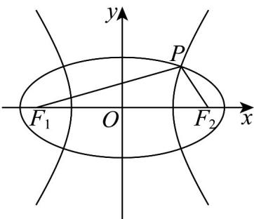

> [!faq]- 《专题11 双曲线标准方程及其性质全方位总结（十大题型）（高效培优期中专项训练）数学人教A版2019高二选择性必修第一册》官方解析
>
> > [!success]- **【答案】** C
>
> > [!note]- **【分析】**
> > 设椭圆的长半轴长为 $a_1$ ，双曲线的实半轴长为 $a_2$ ，利用椭圆、双曲线定义，结合余弦定理求出 $e_1,e_2$ 的关系，再借助三角代换求出最大值·
>
> > [!note]- **【解析】**
> > 设椭圆的长半轴长为 $a_1$ ，双曲线的实半轴长为 $a_2$ ，椭圆及双曲线的半焦距为 $c$ ，则 $\left\{ \begin{array}{l} \left|PF_{1}\right| + \left|PF_{2}\right| = 2a_{1}\\ \left|PF_{1}\right| - \left|PF_{2}\right| = 2a_{2} \end{array} \right.$ ，解得 $|PF_1| = a_1 + a_2$ ， $|PF_2| = a_1 - a_2$ ，而 $|F_1F_2| = 2c$ ， $\cos \angle F_1PF_2 = -\frac{1}{3}$ ，在 $\triangle PF_1F_2$ 中由余弦定理得， $4c^{2} = (a_{1} + a_{2})^{2} + (a_{1} - a_{2})^{2} + 2(a_{1} + a_{2})(a_{1} - a_{2})\cdot \frac{1}{3}$ ，化简得 $2a_{1}^{2} + a_{2}^{2} = 3c^{2}$ ，于是 $\frac{2}{e_1^2} +\frac{1}{e_2^2} = 3$ ，令 $\frac{\sqrt{2}}{e_1} = \sqrt{3}\cos \theta ,\frac{1}{e_2} = \sqrt{3}\sin \theta (0 <   \theta <  \frac{\pi}{2})$
> >
> > 则 $\frac{4}{e_1} +\frac{1}{e_2} = 2\sqrt{6}\cos \theta +\sqrt{3}\sin \theta = 3\sqrt{3}\sin (\theta +\varphi)$ ，其中锐角 $\varphi$ 由 $\tan \varphi = 2\sqrt{2}$ 确定，
> >
> > 当 $\sin (\theta +\varphi) = 1$ 时， $\frac{4}{e_1} +\frac{1}{e_2}$ 取最大值 $3\sqrt{3}$
> >
> > 故选：C
> >
> > 
