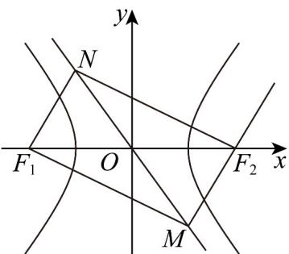
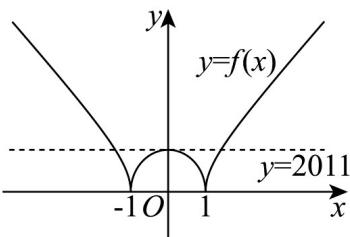

> [!faq]- 《专题11 双曲线标准方程及其性质全方位总结（十大题型）（高效培优期中专项训练）数学人教A版2019高二选择性必修第一册》官方解析
>
> > [!success]- **【答案】** $\left[\sqrt{5},\sqrt{10}\right]$
>
> > [!note]- **【分析】**
> > 联立 $MF_{2}$ 的方程 $y = 2(x - c)$ 与渐近线方程 $y = -\frac{b}{a} x$ ，可得 $M$ 坐标，根据两点斜率公式结合平行求解 $MF_{1}$ 的斜率，即可化简得 $2 \leq \frac{b}{a} \leq 3$ ，进而可求解离心率·
>
> > [!note]- **【解析】**
> > 由题意可得 $F_{1}(-c,0)$ ， $F_{2}(c,0)$
> >
> > 由于 $MF_{1}NF_{2}$ 为平行四边形，故 $NF_{2} / / MF_{1}$
> >
> > 直线 $MF_{2}$ 的方程为 $y = 2(x - c)$ ，渐近线方程 $y = -\frac{b}{a}x$ ，
> >
> > 联立 $\left\{ \begin{array}{l} y = -\frac{b}{a} x \\ y = 2(x - c) \end{array} \right. \Rightarrow x = \frac{2ac}{2a + b}, y = \frac{-2bc}{2a + b}$
> >
> > 故 $M\left(\frac{2ac}{2a + b}, \frac{-2bc}{2a + b}\right)$ ,
> >
> > 所以 $k_{NF_{2}} = k_{MF_{1}} = \frac{\frac{-2bc}{2a + b}}{\frac{2ac}{2a + b} + c} = \frac{-2bc}{4ac + bc} = \frac{-2b}{4a + b}$ ，
> >
> > 因此 $-\frac{6}{7} \leq \frac{-2b}{4a + b} \leq -\frac{2}{3}$ ，化简得 $2a \leq b \leq 3a \Rightarrow 2 \leq \frac{b}{a} \leq 3$ ，
> >
> > 故离心率为 $e = \frac{c}{a} = \sqrt{1 + \frac{b^2}{a^2}}\in [\sqrt{5},\sqrt{10} ]$
> >
> > 故答案为： $\left[\sqrt{5},\sqrt{10}\right]$
> >
> > 
> >
> > 58. 函数 $f(x) = \begin{cases} 2012\sqrt{x^2 - 1}, & x \in (-\infty, -1) \cup (1, +\infty) \\ 2011\sqrt{1 - x^2}, & x \in [-1, 1] \end{cases}$ ，若方程 $f(x) = m$ 恰有三个不同的实数根，则实数 $m$ 的值为 \_\_\_\_.
> >
> > 【答案】2011
> >
> > 【分析】依题意，作出函数 $y = f(x)$ 的图象，由方程 $f(x) = m$ 有三个不同的实数根转化成函数图象与直线 $y = m$ 有三个不同的交点即得.
> >
> > 【详解】
> >
> > 
> >
> > 当 $x \in [-1, 1]$ 时，由 $y = f(x) = 2011\sqrt{1 - x^2}$ 化简可得， $x^2 + \frac{y^2}{2011^2} = 1, (y - 0)$ ，
> >
> > 它表示椭圆 $x^{2} + \frac{y^{2}}{2011^{2}} = 1$ 在 $x$ 轴（含 $x$ 轴）上方的部分图象，如图所示；
> >
> > 当 $x \in (-\infty, -1) \cup (1, +\infty)$ 时，由 $y = f(x) = 2012\sqrt{x^2 - 1}$ 化简可得， $x^2 - \frac{y^2}{2012^2} = 1, (y - 0)$
> >
> > 它表示双曲线 $x^{2} - \frac{y^{2}}{2012^{2}} = 1$ 在 $x$ 轴（含 $x$ 轴）上方的部分图形，如图所示
> >
> > 则方程 $f(x) = m$ 恰有三个不同的实数根，即函数 $y = f(x)$ 的图象与直线 $y = m$ 由三个不同的交点，由图知 $m = 2011$ .
> >
> > 故答案为：2011.
