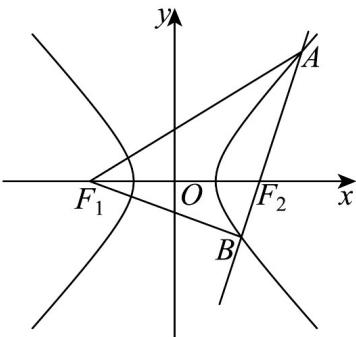

> [!faq]- 《专题11 双曲线标准方程及其性质全方位总结（十大题型）（高效培优期中专项训练）数学人教A版2019高二选择性必修第一册》官方解析
>
> > [!success]- **【答案】** A
>
> > [!note]- **【分析】**
> > 由双曲线的定义求解即可；
>
> > [!note]- **【解析】**
> > 
> >
> > 由题意可得 $a^2 = 4 \Rightarrow 2a = 4$
> >
> > $\triangle ABF_{1}$ 的周长为 $\left|AF_1\right| + \left|BF_1\right| + \left|AB\right|$
> >
> > 由双曲线定定义可得 $\left|AF_1\right| - \left|AF_2\right| = \left|BF_1\right| - \left|BF_2\right| = 4$
> >
> > 又 $\left|AF_2\right| + \left|BF_2\right| = \left|AB\right| = 2$
> >
> > 所以 $\left|AF_1\right| + \left|BF_1\right| + \left|AB\right| = \left|AF_1\right| - \left|AF_2\right| + \left|BF_1\right| - \left|BF_2\right| + 2\left|AB\right| = 4 + 4 + 4 = 12$
> >
> > 所以 $\triangle ABF_{1}$ 的周长为 12，
> >
> > 故选 **A**
