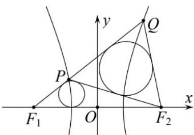

> [!faq]- 《专题11 双曲线标准方程及其性质全方位总结（十大题型）（高效培优期中专项训练）数学人教A版2019高二选择性必修第一册》官方解析
>
> > [!success]- **【答案】**  A. $\left(0, \frac{1}{3}\right)$ B. $\left(0, \frac{3}{8}\right)$ C. $\left(\frac{1}{3}, \frac{1}{2}\right)$ D. $\left(\frac{1}{3}, \frac{3}{8}\right)$
>
> > [!note]- **【分析】**
> > 根举双曲线的定义表示各边，在 $\triangle PF_{1}F_{2}$ 和 $\triangle PQF_{2}$ 中应用余弦定理，根据面积比求出答案·
>
> > [!note]- **【解析】**
> > 设 $|PF_1| = m, |PQ| = n$
> >
> > 则 $\left|PF_{2}\right|=m+2,\left|QF_{2}\right|=m+n-2,\left|F_{1}F_{2}\right|=4,\quad\angle F_{1}PF_{2}+\angle QPF_{2}=\pi$
> >
> > 故在 $\triangle PF_{1}F_{2}$ 和 $\triangle PQF_{2}$ 中由余弦定理可得 $\frac{\left|PF_1\right|^2 + \left|PF_2\right|^2 - \left|F_1F_2\right|^2}{2\left|PF_1\right|\cdot\left|PF_2\right|} = -\frac{\left|PQ\right|^2 + \left|PF_2\right|^2 - \left|QF_2\right|^2}{2\left|PQ\right|\cdot\left|PF_2\right|}$ 即 $\frac{m^2 + (m + 2)^2 - 16}{2m(m + 2)} = -\frac{n^2 + (m + 2)^2 - (m + n - 2)^2}{2n(m + 2)}$ ，解得 $n = \frac{2m^2}{3 - 2m} >2$ ，则 $m\in \left(1,\frac{3}{2}\right)$ 又因为 $\frac{S_{\triangle PF_1F_2}}{S_{\triangle PQF_2}} = \frac{m}{n} = \frac{\frac{1}{2}(2m + 6)r_1}{\frac{1}{2}(2m + 2n)r_2}$ ，则 $\frac{r_1}{r_2} = \frac{m(m + n)}{n(m + 3)} = \frac{3}{2(m + 3)}\in \left(\frac{1}{3},\frac{3}{8}\right)$
> >
> > 故选 **D**.
