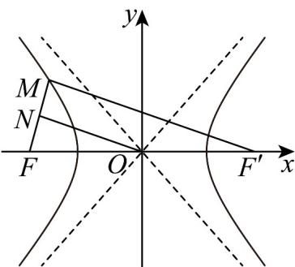

> [!faq]- 《专题11 双曲线标准方程及其性质全方位总结（十大题型）（高效培优期中专项训练）数学人教A版2019高二选择性必修第一册》官方解析
>
> > [!success]- **【答案】** 5
>
> > [!note]- **【分析】**
> > 利用双曲线的定义求解即可·
>
> > [!note]- **【解析】**
> > 设 $F'$ 是双曲线 $C: \frac{x^2}{16} - \frac{y^2}{9} = 1$ 的右焦点，连接 $MF'$ ，
> >
> > 
> >
> > 又 $M$ 在双曲线 $C: \frac{x^2}{16} - \frac{y^2}{9} = 1$ 的左支上，所以 $|MF'| - |MF| = 2a = 8$
> >
> > 又 $|MF|=2$ ，所以 $|MF'|=10$
> >
> > 又 $N$ 为 $MF$ 的中点， $O$ 为 $FF'$ 的中点，
> >
> > 所以 $\left|ON\right|=\frac{1}{2}\left|MF'\right|=5$
> >
> > 故答案为：5·
