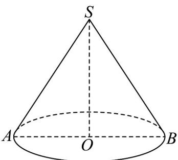
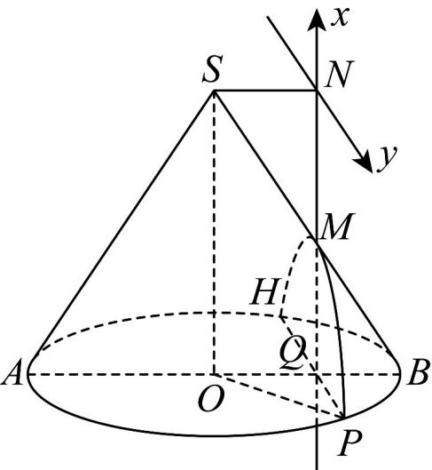

> [!faq]- 《专题11 双曲线标准方程及其性质全方位总结（十大题型）（高效培优期中专项训练）数学人教A版2019高二选择性必修第一册》官方解析
>
> > [!success]- **【答案】**  A. $\frac{2\sqrt{3}}{3}$ B. $\sqrt{3}$ C. $\frac{2\sqrt{6}}{3}$ D. $\sqrt{6}$
>
> > [!note]- **【分析】**
> > 设曲线与圆锥的底面圆交于点 $H, P$ ，取 $OB$ 的中点 $Q$ ，过S作 $SN // AB$ ，交直线 $MQ$ 于点 $N$ ，过点 $N$ 作 $y$ 轴 // HP，建立平面直角坐标系，设双曲线方程为 $\frac{x^2}{a^2} - \frac{y^2}{b^2} = 1 (a > 0, b > 0, x < 0)$ ，得到 $a$ 及点 $P$ 坐标，即可求出 $b$ ，从而求出离心率·
>
> > [!note]- **【解析】**
> > 设曲线与圆锥的底面圆交于点 H, P ， $SO = 2\sqrt{3}$ , OB = 2，
> >
> > 则 SA = SB = AB = 4， $\triangle SAB$ 为等边三角形，
> >
> > 设 M 为 SB 的中点，取 OB 的中点 Q ，
> >
> > 过S作SN//AB，交直线MQ于点N，过点N作y轴//HP
> >
> > 建立如图平面直角坐标系，设双曲线方程为 $\frac{x^2}{a^2} -\frac{y^2}{b^2} = 1(a > 0,b > 0,x <   0)$
> >
> > 得到 $a = MN = \sqrt{3}$ ，又 $HP \perp AB$ ，所以 $PQ = \sqrt{OP^{2} - OQ^{2}} = \sqrt{4 - 1} = \sqrt{3}$ ，
> >
> > 则 $P\left(-2\sqrt{3},\sqrt{3}\right)$
> >
> > 则 $\frac{(-2\sqrt{3})^2}{3} -\frac{(\sqrt{3})^2}{b^2} = 1$ ，故 $b = 1$
> >
> > 从而求出离心率 $e=\sqrt{1+\frac{b^{2}}{a^{2}}}=\frac{2\sqrt{3}}{3}$ .
> >
> > 
> >
> > 故选 **A**.
