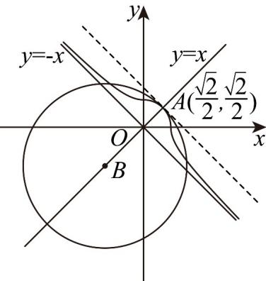

> [!faq]- 《专题11 双曲线标准方程及其性质全方位总结（十大题型）（高效培优期中专项训练）数学人教A版2019高二选择性必修第一册》官方解析
>
> > [!success]- **【答案】** D
>
> > [!note]- **【分析】**
> > 分类讨论方程表示曲线的类型，画出曲线 $E: x|x| + y|y| = 1$ 的图象，再逐项判断。【详解】当 $x > 0, y > 0$ 时，曲线方程为 $x^2 + y^2 = 1$ ，表示圆的一部分，当 $x > 0, y < 0$ 时，曲线方程为 $x^2 - y^2 = 1$ ，表示焦点在 $x$ 轴上的等轴双曲线的一部分，当 $x < 0, y > 0$ 时，曲线方程为 $y^2 - x^2 = 1$ ，表示焦点在 $x$ 轴上的等轴双曲线的一部分，
>
> > [!note]- **【解析】**
> > 其图象如图所示：
> > 
> > A. 因为 y = -x 是等轴双曲线的渐近线，曲线 E 与直线 y = -x 无公共点，故正确；
> > B. 将方程 $x|x| + y|y| = 1$ 中的 $x, y$ 互换后方程不变，所以曲线 $E$ 关于直线 $y = x$ 对称，故正确；
> > C. 圆 $(x + \sqrt{2})^2 + (y + \sqrt{2})^2 = 9$ 的圆心为 $B(-\sqrt{2}, -\sqrt{2})$
> > 又 $\sqrt{(0 + \sqrt{2})^2 + (0 + \sqrt{2})^2} = 3 + 1 = r_1 + r_2$ ，即当 $x > 0, y > 0$ 时，
> > 曲线 $x^{2} + y^{2} = 1$ 与圆 $(x + \sqrt{2})^2 +(y + \sqrt{2})^2 = 9$ 相切，所以有三个公共点，故正确；
> > D. 作与直线 $y = -x$ 平行的直线与曲线 $E$ 切于点 $A\left(\frac{\sqrt{2}}{2}, \frac{\sqrt{2}}{2}\right)$ 上的点到直线 $y = -x$ 的最大距离是 $|OA| = 1$ ，故
> > 错误；
> >
> > 故选 **D**
