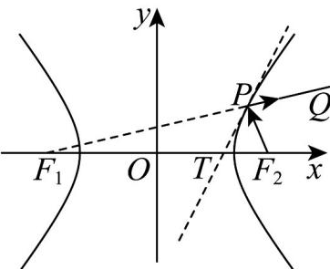
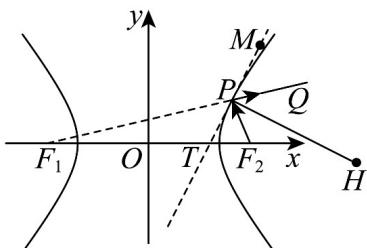

> [!faq]- 《专题11 双曲线标准方程及其性质全方位总结（十大题型）（高效培优期中专项训练）数学人教A版2019高二选择性必修第一册》官方解析
>
> > [!success]- **【答案】** A. $m$ 的取值范围是 $(-6,3)$ B. $m = 1$ 时， $C$ 的渐近线方程为 $y = \pm \frac{\sqrt{7}}{2} x$ C. $C$ 的焦点坐标为 $(-3,0),(3,0)$ D. $C$ 可以是等轴双曲线
>
> > [!note]- **【分析】**
> > 选项 A，利用双曲线的标准方程，即可求解；选项 B，根据条件，利用求双曲线渐近线的求法，即可求解；选项 C，由选项 A 知焦点在 x 轴上，再由 $c^{2}=m+6+3-m=9$ ，即可求解；选项 D，利用等轴双曲线的定义，即可求解。
>
> > [!note]- **【解析】**
> > 对于选项 A，因为 $C: \frac{x^{2}}{3-m}-\frac{y^{2}}{m+6}=1$ 表示双曲线，所以 $(m+6)(3-m)>0$ ，解得 -6<m<3，所以选项 A 正确；
> >
> > 对于选项 B，当 m=1 时，双曲线方程为 $\frac{x^{2}}{2}-\frac{y^{2}}{7}=1$ ，其渐近线方程为 $y=\pm\frac{\sqrt{7}}{\sqrt{2}}x=\pm\frac{\sqrt{14}}{2}x$ ，所以选项 B 错误；
> > 对于选项 C，由选项 A 得 $m+6>0,3-m>0$ ，所以焦点在 x 轴上，设 C 的半焦距为 $c(c>0)$ ，
> > 则 $c^{2}=m+6+3-m=9$ ，解得 c=3，故其焦点坐标为 $(-3,0),(3,0)$ ，所以选项 C 正确；
> > 对于 D，若 C 为等轴双曲线，则 $3 - m = m + 6$ ，解得 $m = -\frac{3}{2} \in (-6, 3)$ ，所以选项 D 正确，
> > 故选：ACD.
> >
> > 70. 圆锥曲线具有丰富的光学性质．双曲线的光学性质：从双曲线的一个焦点 $F_{2}$ 处发出的光线，经过双曲线在点 $P$ 处反射后，反射光线所在直线经过另一个焦点 $F_{1}$ ，且双曲线在点 $P$ 处的切线平分 $\angle F_{1}PF_{2}$ ．如图，对称轴都在坐标轴上的等轴双曲线 $C$ 过点 $(3, -1)$ ，其左、右焦点分别为 $F_{1}, F_{2}$ ．若从 $F_{2}$ 发出的光线经双曲线右支上一点 $P$ 反射的光线为 $PQ$ ，点 $P$ 处的切线交 $x$ 轴于点 $T$ ，则下列说法正确的是（）
> >
> > 【答案】
> >
> > 
> >
> > A. 双曲线 $C$ 的方程为 $x^{2} - y^{2} = 8$
> >
> > B. 过点 $P$ 且垂直于 $PT$ 的直线平分 $\angle F_{2}PQ$
> >
> > C. 若 $PF_{2} \perp PQ$ ，则 $\left|PF_{1}\right| \cdot \left|PF_{2}\right| = 18$
> >
> > D．若 $\angle F_{1}PF_{2} = 60^{\circ}$ ，则 $\left|PT\right| = \frac{4\sqrt{30}}{5}$
> >
> > 【答案】ABD
> >
> > 【分析】选项A，利用条件，设双曲线方程为 $\frac{x^2}{a^2} -\frac{y^2}{a^2} = 1(a > 0)$ ，再利用双曲线过点(-3,1)，即可求解；选项B，根据条件，借助图形，即可求解；选项C，利用余弦定理及双曲线的定义，得到 $S_{\triangle F_1PF_2} = \frac{b^2}{\tan\frac{\angle F_1PF_2}{2}}$ 再结合条件，即可求解；选项D，利用C中结果 $S_{\triangle F_{1}PF_{2}}=\frac{b^{2}}{\tan\frac{\angle F_{1}PF_{2}}{2}}$ ，再结合条件，即可求解·
> >
> > 【详解】对于 $\mathsf{A}$ ，因为双曲线为等轴双曲线，设双曲线方程为 $\frac{x^2}{a^2} -\frac{y^2}{a^2} = 1(a > 0)$
> >
> > 所以 $\frac{9}{a^2} -\frac{1}{a^2} = 1$ ，解得 $a^2 = 8$ ，得到双曲线的方程为 $x^{2} - y^{2} = 8$ ，正确，
> >
> > 
> >
> > 对于 B，如图，由题知 $\angle F_{1}PT = \angle F_{2}PT$ ， $\angle F_{1}PT = \angle QPM$ ，所以 $\angle MPQ = \angle F_{2}PT$ ，
> >
> > 若 $HP \perp TM$ ，所以 $\angle F_{2}PH = \angle QPH$ ，正确，
> >
> > 对于 $\mathsf{C}$ ，记 $\left|PF_1\right| = m,\left|PF_2\right| = n$ ，所以 $\left|F_1F_2\right|^2 = m^2 +n^2 -2mn\cos \angle F_1PF_2 = (m - n)^2 +2mn - 2mm\cos \angle F_1PF_2$
> >
> > 又 $\left|F_{1}F_{2}\right| = 2c, m - n = 2a$ ，得到 $mn = \frac{2b^{2}}{1 - \cos\angle F_{1}PF_{2}}$ ，又 $S_{\triangle F_1PF_2} = \frac{1}{2} mn\sin\angle F_1PF_2$ ，
> >
> > 所以 $S_{\triangle F_{1}PF_{2}}=\frac{1}{2}\times\frac{2b^{2}}{1-\cos\angle F_{1}PF_{2}}\times\sin\angle F_{1}PF_{2}=\frac{b^{2}}{\tan\frac{\angle F_{1}PF_{2}}{2}}$ ，又 $\angle F_{1}PF_{2}=\frac{\pi}{2}$ ，
> >
> > 由 $\frac{1}{2} mn = \frac{b^2}{\tan 45^\circ} = 8$ ，得 $mn = 16$ ，错误，
> >
> > 对于 D，因为 $\angle F_{1}PF_{2}=60^{\circ}$ ， $\left|PF_{1}\right|=m,\left|PF_{2}\right|=n$
> >
> > 由 $\frac{1}{2} mn\sin 60^{\circ} = \frac{b^{2}}{\tan 30^{\circ}}$ ，得 $mn = 32$ ，
> >
> > 又 $m - n = 4\sqrt{2}$ ，得到 $m^2 - 2mn + n^2 = 32$ ，得到 $m^2 + n^2 = 96$
> >
> > 从而有 $(m+n)^{2}=160$ ，得到 $m+n=4\sqrt{10}$ ，
> >
> > 由 $\frac{1}{2} m\cdot |PT|\sin 30^{\circ} + \frac{1}{2} n\cdot |PT|\sin 30^{\circ} = \frac{b^{2}}{\tan 30^{\circ}}$ ，得到 $\frac{1}{2}\big(m + n\big)|PT|\sin 30^{\circ} = \frac{b^{2}}{\tan 30^{\circ}}$
> >
> > 从而有 $\frac{1}{2} (m + n)|PT|\sin 30^{\circ} = \frac{b^{2}}{\tan 30^{\circ}} = 8\sqrt{3}$ ，解得 $|PT| = \frac{4\sqrt{30}}{5}$ ，正确，
> >
> > 故选 **ABD**.
