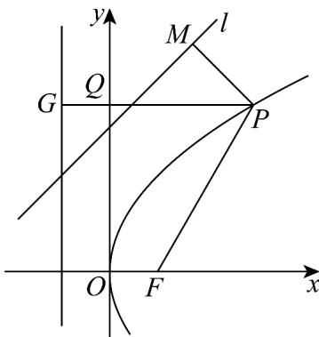

> [!faq]- 《专题12 抛物线标准方程及其性质全方位总结（八大题型）（高效培优期中专项训练）数学人教A版2019高二选择性必修第一册》官方解析
>
> > [!success]- **【答案】** $4 - \sqrt{2} / -\sqrt{2} + 4$
>
> > [!note]- **【分析】**
> > 过抛物线 $y^{2}=4x$ 上的动点 $P(x_{0},y_{0})$ 作直线 $l:x-y+3=0$ 的垂线交直线于 M，过点 $P(x_{0},y_{0})$ 作 y 轴的垂线交 y 轴于 Q，交准线于 G 点，F 为抛物线焦点，根据点到直线距离公式及抛物线的定义得，
> >
> > $\left|PM\right| + \left|PQ\right| = \left|PM\right| + \left|PF\right| - 1$ $\left|MF\right| - 1 = 2\sqrt{2} -1$ ，则 $\sqrt{2} x_0 + \left|x_0 - y_0 + 3\right| = \sqrt{2}\left(\left|MF\right| - 1\right)$ 进而求解.
>
> > [!note]- **【解析】**
> > 由题可知，过抛物线 $y^{2}=4x$ 上的动点 $P(x_{0},y_{0})$ 作直线 $l:x-y+3=0$ 的垂线交直线于 M ，过点 $P(x_{0},y_{0})$ 作 y 轴的垂线交 y 轴于 Q ，交准线于 G 点，F 为抛物线焦点，
> >
> > 由 $y^{2}=4x$ ，得 p=2，所以 $F(1,0)$ ，则 $\left|QG\right|=1$ ，如图所示，
> >
> > 则 $\left|PM\right|=\frac{\left|x_{0}-y_{0}+3\right|}{\sqrt{2}}$ ，动点 $P(x_{0},y_{0})$ 到y轴的距离为 $\left|PQ\right|=\left|x_{0}\right|=x_{0}(x_{0}\quad0)$ ，
> >
> > 所以 $\frac{\left|x_0 - y_0 + 3\right|}{\sqrt{2}} + x_0 = |PM| + |PG| - 1 = |PM| + |PF| - 1$
> >
> > 当且仅当 $F$ 、 $P$ 、 $M$ 三点共线时， $\left|PM\right| + \left|PQ\right|$ 有最小值，
> >
> > 所以 $\left|PM\right|+\left|PQ\right|=\left|PM\right|+\left|PF\right|-1$ $\left|MF\right|-1$ ，（ $\left|MF\right|$ 为点F到直线l的距离），
> >
> > 因为 $F(1,0)$ 到直线 $l:x - y + 3 = 0$ 的距离为 $\frac{|1 + 3|}{\sqrt{2}} = 2\sqrt{2}$
> >
> > 所以要求的最值为 $\sqrt{2}\left(|MF| - 1\right) = \sqrt{2}\left(2\sqrt{2} -1\right) = 4 - \sqrt{2}$
> >
> > 故答案为： $4-\sqrt{2}$
> >
> > 
