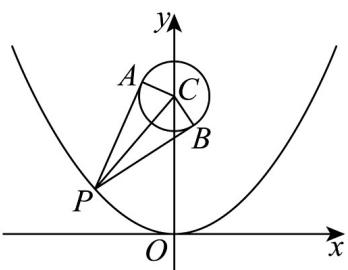

> [!faq]- 《专题12 抛物线标准方程及其性质全方位总结（八大题型）（高效培优期中专项训练）数学人教A版2019高二选择性必修第一册》官方解析
>
> > [!success]- **【答案】** A. $\frac{1}{2}$ B. $\frac{5}{6}$ C. $\frac{3}{4}$ D. $\frac{7}{9}$
>
> > [!note]- **【分析】**
> > 由题意作图，根据余弦的二倍角公式，利用两点距离公式，可得答案·
>
> > [!note]- **【解析】**
> > 由圆的方程 $x^{2} + (y - 4)^{2} = 1$ ，则圆心 $C(0,4)$ ，半径 $r = 1$ ，结合题意作图如下：
> >
> > 
> >
> > 由 $PA, PB$ 与圆相切，则 $\angle APB = 2\angle APC$ ，且 $CA \perp PA$
> >
> > $$
> > \cos \angle A P B = \cos 2 \angle A P C = 1 - 2 \sin^ {2} \angle A P C = 1 - 2 \left(\frac {C A}{C P}\right) ^ {2} = 1 - 2 \left(\frac {1}{C P}\right) ^ {2}
> > $$
> >
> > 设 $P(x,y)$ ，则 $x^{2} = 4y$ ，可得 $CP = \sqrt{(0 - x)^{2} + (4 - y)^{2}} = \sqrt{(y - 2)^{2} + 12}$
> >
> > $CP$ 的最小值为 $\sqrt{12}$ ， $\cos \angle APB$ 的最大值为 $\frac{5}{6}$
> >
> > 故选 **B**.
