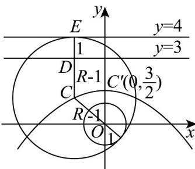

> [!faq]- 《专题12 抛物线标准方程及其性质全方位总结（八大题型）（高效培优期中专项训练）数学人教A版2019高二选择性必修第一册》官方解析
>
> > [!success]- **【答案】** $\frac{1}{2} / 0.5$
>
> > [!note]- **【分析】**
> > 根据直线与圆、圆与圆的位置关系结合抛物线的定义确定 C 的轨迹，计算即可·
>
> > [!note]- **【解析】**
> > 如图，设圆 C 的半径为 R，则 $\left|CO\right|=R-1$ ；
> >
> > 又 C 到 l: y = 4 的距离为 R，则 C 到 y = 3 的距离为 R - 1.
> >
> > 所以 $C$ 的轨迹是以 $O$ 为焦点，以 $y = 3$ 为准线的抛物线，顶点为 $C^{\prime}\left(0,\frac{3}{2}\right)$
> >
> > 则 $\left|PC\right|\quad\left|CO\right|-1\quad\left|C'O\right|-1=\frac{1}{2}.$
> >
> > 
