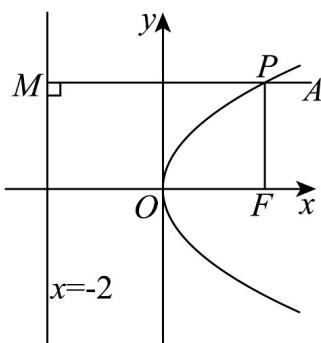

> [!faq]- 《专题12 抛物线标准方程及其性质全方位总结（八大题型）（高效培优期中专项训练）数学人教A版2019高二选择性必修第一册》官方解析
>
> > [!success]- **【答案】** 6
>
> > [!note]- **【分析】**
> > 根据题意，画出图形，结合图形和抛物线的定义，求出 $\left|PF\right|+\left|PA\right|$ 的最小值.
>
> > [!note]- **【解析】**
> > 根据题意，过点 P 作 PM 垂直准线于点 M ，如图所示：
> >
> > 
> >
> > 根据抛物线的定义，抛物线上的点到抛物线 $y^{2} = 8x$ 的焦点 $F$ 的距离等于到它的准线 $x = -2$ 的距离，所以 $|PF| + |PA| = |PM| + |PA|$ ，当 $A, P, M$ 三点共线时取得最小值，
> >
> > 所以 $\left|PF\right|+\left|PA\right|$ 的最小值为 6.
> >
> > 故答案为：6·
