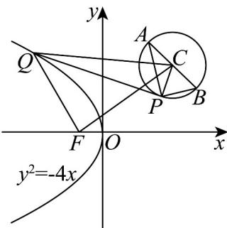

> [!faq]- 《专题12 抛物线标准方程及其性质全方位总结（八大题型）（高效培优期中专项训练）数学人教A版2019高二选择性必修第一册》官方解析
>
> > [!success]- **【答案】** A
>
> > [!note]- **【分析】**
> > 分析可知点 $P$ 在以 $AB$ 为直径的圆上（不含 $(4,4)$ ），根据抛物线的定义可得 $-x = |QF| - 1$ ，结合圆下性质可得 $|PQ| - x\quad |QC| + |QF| - (\sqrt{2} +1)$ ，再根据几何性质即可得结果·
>
> > [!note]- **【解析】**
> > 直线 $l_{1}:x - my + 4m - 2 = 0$ ，即 $(x - 2) - m(y - 4) = 0$ ，可知直线 $l_{1}$ 过定点 $A(2,4)$ ；
> >
> > 直线 $l_{2}:mx + y - 4m - 2 = 0$ ，即 $m(x - 4) + (y - 2) = 0$ ，可知直线 $l_{2}$ 过定点 $B(4,2)$ ；
> >
> > 且 $1\times m + (-m)\times 1 = 0$ ，则 $l_{1}\perp l_{2}$ ，
> >
> > 可知点 $P$ 在以 $AB$ 为直径的圆上（不含 $(4,4)$ ），此时圆心为 $C(3,3)$ ，半径 $r = \frac{1}{2}|AB| = \sqrt{2}$ .
> >
> > 因为抛物线 $y^{2} = -4x$ 的焦点为 $F(-1,0)$ ，准线为 $x = 1$ ，
> >
> > 
> >
> > 且点 $Q(x,y)$ 是抛物线 $y^{2} = -4x$ 上一动点，则 $\left|QF\right| = 1 - x$ ，即 $-x = \left|QF\right| - 1$ 可得 $\left|PQ\right| - x = \left|PQ\right| + \left|QF\right| - 1$ $\left|QC\right| - r + \left|QF\right| - 1 = \left|QC\right| + \left|QF\right| - \left(\sqrt{2} +1\right)$
> >
> > 当且仅当点 $P$ 在线段 $QC$ 上时，等号成立，
> >
> > 又因为 $\left|QC\right|+\left|QF\right|\quad\left|CF\right|=5$ ，当且仅当点Q在线段FC上时，等号成立，
> > 即 $\left|PQ\right|-x\quad\left|QC\right|+\left|QF\right|-\left(\sqrt{2}+1\right)\quad5-\left(\sqrt{2}+1\right)=4-\sqrt{2}$
> >
> > 所以 $|PQ|-x$ 的最小值为 $4-\sqrt{2}$ .
> >
> > 故选 **A**.
