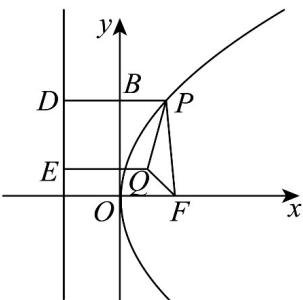

> [!faq]- 《专题12 抛物线标准方程及其性质全方位总结（八大题型）（高效培优期中专项训练）数学人教A版2019高二选择性必修第一册》官方解析
>
> > [!success]- **【答案】** C
>
> > [!note]- **【分析】**
> > 利用抛物线的定义、性质及数形结合判定选项即可·
>
> > [!note]- **【解析】**
> > 因为 $|PF|$ 等于点P到准线的距离，作PD垂直于准线于D，根据抛物线的定义可知 $\left|PF\right|=\left|PD\right|$ ，所以当PQ垂直于准线时交准线于E， $|PQ|+|PF|$ 有最小值， $\left|PF\right|+\left|PQ\right|=\left|PD\right|+\left|PQ\right|\quad\left|EQ\right|$ ，最小值为 $\frac{p}{2}+x_{Q}=8$ .
> >
> > 当且仅当 P 在 EQ 与抛物线的交点时取得等号·
> >
> > 
> >
> > 故选 **C**.
