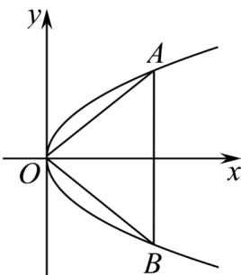

> [!faq]- 《专题12 抛物线标准方程及其性质全方位总结（八大题型）（高效培优期中专项训练）数学人教A版2019高二选择性必修第一册》官方解析
>
> > [!success]- **【答案】** 6
>
> > [!note]- **【分析】**
> > 设等边三角形边长为 a，根据抛物线的对称性以及等边三角形的对称性，表示出顶点 A 的坐标，代入抛物线方程，即可求得答案.
>
> > [!note]- **【解析】**
> > 由题意可知等边三角形的一个顶点位于原点，另外两个顶点在抛物线 $y^{2} = \sqrt{3} x$ 上
> >
> > 则另两个顶点关于 $x$ 轴对称，不妨设如图示：
> >
> > 
> >
> > 设等边三角形边长为 $a$ ，则 $A$ 点横坐标为 $a \times \cos 30^{\circ} = \frac{\sqrt{3}}{2} a$
> >
> > 则 $A(\frac{\sqrt{3}}{2} a, \frac{1}{2} a)$ ，代入 $y^2 = \sqrt{3} x$ 得 $(\frac{1}{2} a)^2 = \sqrt{3} \times \frac{\sqrt{3}}{2} a$
> >
> > 解得 $a = 6$ （ $a = 0$ 舍）
> >
> > 故等边三角形的边长为 $^{6}$ ，
> >
> > 故答案为：6
