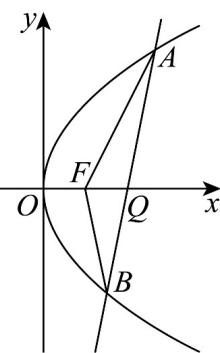

> [!faq]- 《专题12 抛物线标准方程及其性质全方位总结（八大题型）（高效培优期中专项训练）数学人教A版2019高二选择性必修第一册》官方解析
>
> > [!success]- **【答案】** (1) $y^{2}=4x$ ； (2) $2x - y - 4 = 0$ 或 $2x + y - 4 = 0$ .
>
> > [!note]- **【分析】**
> > （1）根据题设易得 $p = 2$ ，即可得抛物线方程；
> >
> > (2) 设 $AB: x = ty + 2$ ， $A(x_1, y_1), B(x_2, y_2)$ ，联立抛物线，应用点线距离公式、韦达定理及弦长公式，结合已知三角形的面积列方程求参数 $t$ ，即可得
>
> > [!note]- **【解析】**
> > （1）由点 $P$ 到直线 $l$ 的距离与其到 $x$ 轴的距离都等于2，则 $\left|y_{P}\right| = \left|x_{P} + \frac{p}{2}\right| = 2$
> >
> > 不妨令 $y_{P} = 2$ ，则 $x_{P} = \frac{2}{p}$ ，结合 $\left|x_P + \frac{p}{2}\right| = 2$ ，则 $\frac{2}{p} +\frac{p}{2} = 2$ ，解得 $p = 2$ ，
> >
> > $$
> > y ^ {2} = 4 x
> > $$
> >
> > (2) 由题设，可设 $AB: x = ty + 2$ ，则 $F(1,0)$ 到该直线的距离 $d = \frac{1}{\sqrt{1 + t^2}}$ ，
> >
> > 联立 $AB: x = ty + 2$ 与 $y^{2} = 4x$ ，可得 $y^{2} - 4ty - 8 = 0$ ， $\Delta = 16t^{2} + 32 > 0$
> >
> > 若 $A(x_{1},y_{1}),B(x_{2},y_{2})$ ，所以 $y_{1} + y_{2} = 4t$ ， $y_{1}y_{2} = -8$
> >
> > 所以 $|AB| = \sqrt{1 + t^2} \cdot \sqrt{16t^2 + 32}$ ，故 $\frac{1}{2} d |AB| = 2\sqrt{t^2 + 2} = 3$ ，可得 $t = \pm \frac{1}{2}$ ，
> >
> > 所以 $AB: x = \pm \frac{1}{2} y + 2$ ，即 2x - y - 4 = 0 或 $2x + y - 4 = 0$ .
> >
> > 
