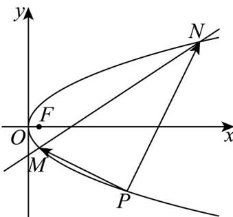

> [!faq]- 《专题12 抛物线标准方程及其性质全方位总结（八大题型）（高效培优期中专项训练）数学人教A版2019高二选择性必修第一册》官方解析
>
> > [!success]- **【答案】** (1) $y^{2}=4x$ (2) $y^{2}=2x-1$ (3)存在， $P(0,0),(9,-6)$
>
> > [!note]- **【分析】**
> > （1）将点 $M(1, - 2)$ 代入抛物线方程计算可得 $p = 2$ ，即可求出结果；
> >
> > (2) 设点 $P(x_{0}, y_{0})$ ， $Q(x, y)$ ，根据中点坐标公式进行代换可得点 Q 的轨迹方程；
> >
> > (3) 联立直线方程并利用垂直关系的向量表示，结合向量数量积的坐标运算即可求得结果.
>
> > [!note]- **【解析】**
> > （1）已知点 $M(1, - 2)$ 在抛物线 $y^{2} = 2px$ 上
> >
> > 代入得 $(-2)^{2}=2p\cdot1\Rightarrow4=2p\Rightarrow p=2.$
> >
> > 所以抛物线方程为 $y^{2} = 4x$
> >
> > (2) 易知抛物线焦点为 $F(1,0)$
> >
> > 设动点 $P(x_0, y_0)$ ，中点的坐标为 $Q(x, y)$
> >
> > 显然 $y_{0}^{2}=4x_{0}$ ;
> >
> > 且 $x = \frac{x_0 + 1}{2} \Rightarrow x_0 = 2x - 1$ ， $y = \frac{y_0 + 0}{2} \Rightarrow y_0 = 2y$
> >
> > $\therefore (2y)^{2} = 4(2x - 1) \Rightarrow y^{2} = 2x - 1$
> >
> > 即点 Q 的轨迹方程为 $y^{2}=2x-1$ ；
> >
> > (3) 设点 $P(x_{0}, y_{0})$ 在抛物线上，则 $y_{0}^{2} = 4x_{0}$
> >
> > 直线 $l$ 的方程为 $y = \frac{2}{3} (x - 1) - 2$ ，如下图：
> >
> > 
> >
> > 联立 $\left\{\begin{aligned}y&=\frac{2}{3}(x-1)-2\\ y^{2}&=4x\end{aligned}\right.$ ，解得 $\left\{\begin{aligned}x_{1}&=1\\ y_{1}&=-2\end{aligned}\right.$ ， $\left\{\begin{aligned}x_{2}&=16\\ y_{2}&=8\end{aligned}\right.$
> >
> > 所以 $N(16,8)$ ,
> >
> > 因此 $\overline{PM}=\left(1-x_{0},-2-y_{0}\right),\overline{PN}=\left(16-x_{0},8-y_{0}\right)$
> >
> > 依题意可得 $PM \cdot PN = 0 \Rightarrow (1 - x_{0})(16 - x_{0}) + (-2 - y_{0})(8 - y_{0}) = 0.$
> >
> > 可得 $\left(\frac{y_0^2}{4}\right)^2 - 13 \times \frac{y_0^2}{4} - 6y_0 = 0$
> >
> > 整理可得 $y_{0}^{4}-52y_{0}^{2}-96y_{0}=0$ ，即 $y_{0}(y_{0}+2)(y_{0}-8)(y_{0}+6)=0$
> >
> > 解得 $y_{0}=0$ 或 $y_{0}=-2$ 或 $y_{0}=-6$ 或 $y_{0}=8$ ；
> >
> > 显然当 $y_0 = -2$ 或 $y_0 = 8$ 时，与 $M, N$ 重合，不合题意；
> >
> > 所以存在 $P(0,0),(9,-6)$ ，满足题意.
