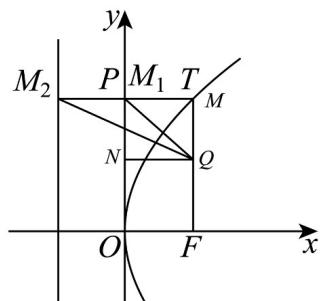

> [!faq]- 《专题12 抛物线标准方程及其性质全方位总结（八大题型）（高效培优期中专项训练）数学人教A版2019高二选择性必修第一册》官方解析
>
> > [!success]- **【答案】** (1,2)
>
> > [!note]- **【分析】**
> > 根据题意可得 $\angle PMF = 90^{\circ}$ ，再利用圆的方程与曲线联立即可求解
>
> > [!note]- **【解析】**
> > 设线段 $FM$ 的中点为 $Q$ ，作 $QN \perp y$ 轴于点 $N$ ， $MM_{1} \perp y$ 轴于点 $M_{1}$
> >
> > 直线 $MM_{1}$ 交 $C$ 的准线 $l$ 于点 $M_{2}$
> >
> > 
> >
> > 则 $2|QN| = |MM_1| + |OF| = |MM_2| = |MF|$ ，故 $\left|QN\right| = \frac{1}{2}\left|MF\right| = \left|QM\right|$
> >
> > 过点 $Q$ 作 $QT \perp MP$ 于点 $T$ ，由 $PQ$ 是 $\angle OPM$ 的平分线，知 $\left|QN\right| = \left|QT\right| = \left|QM\right|$
> >
> > <!-- source-part:2 pages:51-55 -->
> >
> > 由垂线段的唯一性知 $T, M$ 两点重合，可得 $\angle PMF = 90^{\circ}$
> >
> > 则点 M 在以线段 PF 为直径的圆上.
> >
> > 设 $M(x,y)$ ，则由 $P(0,2)$ ， $F(1,0)$ 得 $\left(x - \frac{1}{2}\right)^2 + (y - 1)^2 = \frac{5}{4}$
> >
> > $$
> > x = \frac {y ^ {2}}{4}
> > $$
> >
> > $$
> > y \left(y ^ {3} + 1 2 y - 3 2\right) = 0
> > $$
> >
> > $$
> > y \neq 0
> > $$
> >
> > $$
> > y ^ {3} + 1 2 y - 3 2 = 0
> > $$
> >
> > ，即 $y^{3} - 8 + 12y - 24 = 0$ ，即 $(y - 2)(y^2 + 2y + 16) = 0$ ，得 $y = 2$ ，所以 $x = 1$ ：
> >
> > 故点M的坐标为 $(1,2)$ .
> >
> > 故答案为： $(1,2)$ .
