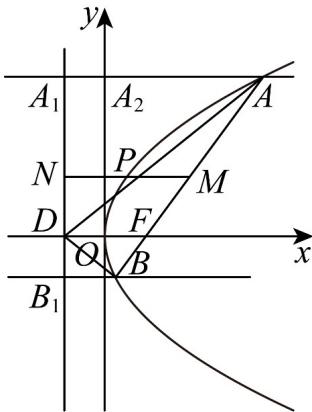

## 考点 08 抛物线与中点有关考点

56. 抛物线 $y^{2} = 4x$ 的焦点为 $F$ ，过 $F$ 的直线交抛物线于 $A, B$ ，以下说法正确的有（）A．以 $AF$ 为直径的圆与 $y$ 轴相切B．以 $AB$ 为直径的圆与抛物线的准线相离C．若点 $D$ 为抛物线准线与 $x$ 轴交点，则一定有 $\angle ADF = \angle BDF$ D．过线段 $AB$ 的中点 $M$ 作 $y$ 轴的垂线，交抛物线于点 $P$ ，交抛物线的准线于点 $N$ ，则 $|PM| = |PN|$

【答案】 ACD

【分析】

对于 A，设点 A 在 y 轴上的投影为 $A_{2}$ ，在准线上的投影为 $A_{1}$ ，O 为坐标原点， $|AF| = a$ ，求以 AF 为直径的圆的半径和 AF 的中点到 y 轴的距离，由此判断 A，对于 B，设点 A, B 在准线上的投影为 $A_{1}, B_{1}$ ， $|BF| = b$ ，根据抛物线的定义可得线段 AB 的中点到准线的距离为 $\frac{|AB|}{2}$ ，从而可判断 B；对于 C，设直线 AB 方程为 $x = my + 1$ ，利用设而不求法求 $k_{AD} + k_{BD}$ ，由此判断 C，对于 D，设线段 AB 的中点 $M(x_{0}, y_{0})$ ，根据 C 的解答求 M, P, N 的坐标，由此判断 D.

【详解】对于 $\mathsf{A}$ ，设点 $A$ 在 $y$ 轴上的投影为 $A_{2}$ ，在准线上的投影为 $A_{1}$ ， $O$ 为坐标原点， $\left|AF\right| = a$

则 $\left|OF\right|=\left|A_{1}A_{2}\right|=1,\quad\left|AA_{1}\right|=\left|AF\right|=a$

因为以 $AF$ 为直径的圆的半径为 $\frac{a}{2}$

$AF$ 的中点到 $y$ 轴的距离为 $\frac{\left|AA_{2}\right|+\left|OF\right|}{2}=\frac{\left|AA_{2}\right|+\left|A_{1}A_{2}\right|}{2}=\frac{\left|AA_{1}\right|}{2}=\frac{\left|AF\right|}{2}=\frac{a}{2}$

故以 $AF$ 为直径的圆与 $y$ 轴相切，故 $\mathsf{A}$ 正确；

对于 $B$ ，设点 $B$ 在准线上的投影为 $B_{1}$ ， $\left|BF\right| = b$ ，则 $\left|BB_1\right| = b$

所以线段 $AB$ 的中点到准线的距离为 $\frac{|AA_1| + |BB_1|}{2} = \frac{a + b}{2} = \frac{|AF| + |BF|}{2} = \frac{|AB|}{2}$

所以以线段 AB 为直径的圆与准线 l 相切，故 B 错误；

对于 $\mathbb{C}$ ，点 $D$ 为抛物线准线与 $x$ 轴交点，所以 $D\left(-\frac{p}{2},0\right)$

若直线 $AB$ 的斜率为0，则直线 $AB$ 与抛物线有且只有一个交点，矛盾，

故可设直线 $AB$ 方程为 $x = my + 1$

联立 $\left\{\begin{aligned}x&=my+1\\ y^{2}&=4x\end{aligned}\right.$ ，消去 x，得 $y^{2}-4my-4=0$ ，

方程 $y^{2} - 4my - 4 = 0$ 的判别式 $\Delta = 16(m^{2} + 1) > 0$

所以 $y_{1} + y_{2} = 4m$ ， $y_{1}y_{2} = -4$

$$
k _ {A D} + k _ {B D} = \frac {y _ {1}}{x _ {1} + 1} + \frac {y _ {2}}{x _ {2} + 1} = \frac {x _ {1} y _ {2} + x _ {2} y _ {1} + (y _ {1} + y _ {2})}{(x _ {1} + 1) (x _ {2} + 1)} = \frac {(m y _ {1} + 1) y _ {2} + (m y _ {2} + 1) y _ {1} + (y _ {1} + y _ {2})}{(m y _ {1} + 1 + 1) (m y _ {2} + 1 + 1)}
$$

$= \frac{2my_{1}y_{2} + 2(y_{1} + y_{2})}{m^{2}y_{1}y_{2} + 2m(y_{1} + y_{2}) + 4} = 0$ ，所以 $\angle ADF = \angle BDF$ ，故C正确；

对于 $\mathsf{D}$ ，设线段 $AB$ 的中点 $M(x_0,y_0)$

由 C 选项的解析可得 $y_{0}=\frac{y_{1}+y_{2}}{2}=2m$ ， $x_{0}=my_{0}+1=2m^{2}+1$ ，

所以 $M(2m^{2} + 1,2m)$ ， $P(m^2,2m)$ ， $N(-1,2m)$

所以 $\left|PM\right|=m^{2}+1=\left|PN\right|$ ，故 D 正确；

故选：ACD.

![[高中/课堂同步/题库/人教A版高中数学同步讲义(2026)/03_选择性必修第一册/期中专项训练+期中模拟卷/专题12 抛物线标准方程及其性质全方位总结（八大题型）（高效培优期中专项训练）数学人教A版2019高二选择性必修第一册/考点_08_抛物线与中点有关考点/questions/Q00079633.md]]
![[高中/课堂同步/题库/人教A版高中数学同步讲义(2026)/03_选择性必修第一册/期中专项训练+期中模拟卷/专题12 抛物线标准方程及其性质全方位总结（八大题型）（高效培优期中专项训练）数学人教A版2019高二选择性必修第一册/考点_08_抛物线与中点有关考点/questions/Q00079634.md]]
![[高中/课堂同步/题库/人教A版高中数学同步讲义(2026)/03_选择性必修第一册/期中专项训练+期中模拟卷/专题12 抛物线标准方程及其性质全方位总结（八大题型）（高效培优期中专项训练）数学人教A版2019高二选择性必修第一册/考点_08_抛物线与中点有关考点/questions/Q00079635.md]]
![[高中/课堂同步/题库/人教A版高中数学同步讲义(2026)/03_选择性必修第一册/期中专项训练+期中模拟卷/专题12 抛物线标准方程及其性质全方位总结（八大题型）（高效培优期中专项训练）数学人教A版2019高二选择性必修第一册/考点_08_抛物线与中点有关考点/questions/Q00079636.md]]
