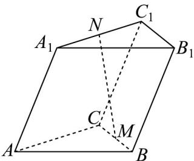

<!-- question-source:start -->
5．如图，在斜三棱柱 $ABC-A_{1}B_{1}C_{1}$ 中，M 为 BC 的中点，N 为 $A_{1}C_{1}$ 靠近 $A_{1}$ 的三等分点，设 $AB=a,AC$

$\stackrel{\rightarrow}{b}, AA_{1} = \stackrel{\rightarrow}{c}$ ，则用 $\stackrel{\rightarrow}{a}, b, c$ 表示 NM 为（）

A. $\frac{1}{2} a + \frac{1}{6}\vec{b} -\vec{c}$ B. $-\frac{1}{2} a + \frac{1}{6}\vec{b} +\vec{c}$ C. $\frac{1}{2} a - \frac{1}{6}\vec{b} -\vec{c}$ D. $-\frac{1}{2} a - \frac{1}{6}\vec{b} +\vec{c}$
<!-- question-source:end -->

![[高中/课堂同步/题库/人教A版高中数学同步讲义(2026)/03_选择性必修第一册/期中专项训练+期中模拟卷/阶段测试/高二数学上学期期中模拟卷_人教A版2019_高效培优_强化卷_/一_选择题_sec_02/questions/answers/Q00062611A1.md]]
