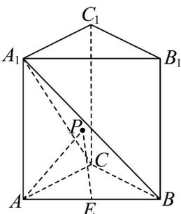

<!-- question-source:start -->
8．如图，在直三棱柱 $ABC-A_{1}B_{1}C_{1}$ 中， $AC\perp AB$ ， $AC=AB=CC_{1}=1$ ，E 是线段 AB 的中点，在 $\triangle A_{1}BC$ 内有一动点 P（包括边界），则 $\left|\overline{PA}\right|+\left|\overline{PE}\right|$ 的最小值是（）.

A. $\frac{\sqrt{33}}{2}$ B. $\frac{2\sqrt{33}}{3}$ C. $\frac{\sqrt{33}}{6}$ D. $\frac{\sqrt{33}}{3}$
<!-- question-source:end -->

![[高中/课堂同步/题库/人教A版高中数学同步讲义(2026)/03_选择性必修第一册/期中专项训练+期中模拟卷/阶段测试/高二数学上学期期中模拟卷_人教A版2019_高效培优_强化卷_/一_选择题_sec_02/questions/answers/Q00062613A1.md]]
