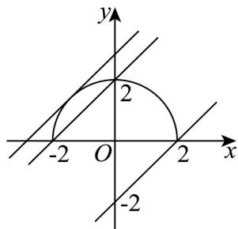

> [!faq]- 《高二数学上学期期中模拟卷_人教A版2019_高效培优_强化卷_》官方解析
>
> > [!success]- **【答案】** A
>
> > [!note]- **【解析】**
> > 因为 $x$ 轴正半轴与直线 $l$ 的垂线的倾斜角为 $\frac{\pi}{6}$
> >
> > ∴直线 l 的倾斜角为 $\frac{\pi}{6} + \frac{\pi}{2} = \frac{2\pi}{3}$
> >
> > 所以直线 $l$ 的斜率为 $k = \tan \frac{2\pi}{3} = -\sqrt{3}$
> >
> > 对于 B： $\sqrt{3}x-y+4=0$ 的斜率为 $\sqrt{3}$ ，B 选项错误；
> >
> > 对于 C： $-\sqrt{3}x + y + 4 = 0$ 的斜率为 $\sqrt{3}$ ，C 选项错误；
> >
> > 对于D： $x + \sqrt{3} y + 4 = 0$ 的斜率为 $-\frac{\sqrt{3}}{3}$ ，D选项错误；
> >
> > 对于 A：点 O 到直线 l 的距离为 $\frac{4}{\sqrt{3+1}} = 2$ ，A 选项正确；
> >
> > 故选：A.
> >
> > 3. “ $-2 \leq b < 2$ ”是“直线 $y = x + b$ 与曲线 $y = \sqrt{4 - x^2}$ 恰有1个公共点”的（）
> >
> > A．充分不必要条件 B．必要不充分条件 C．充分必要条件 D．既不充分也不必要条件
> >
> > 【答案】A
> >
> > 【详解】曲线 $y=\sqrt{4-x^{2}}$ 表示圆心 $(0,0)$ ，半径为 2 的圆的上半部分（包括与 x 轴的交点），
> >
> > 直线 $y = x + b$ 的斜率为 1，在 y 轴上的截距为 b，
> >
> > 当直线 $y = x + b$ 与曲线 $y = \sqrt{4 - x^{2}}$ 恰有 1 个公共点时，该直线与曲线相切或有一个交点，
> >
> > 如图所示：
> >
> > 
> >
> > 相切时，圆心 $(0,0)$ 到直线 $y = x + b$ 距离等于2，则 $\frac{|b|}{\sqrt{2}} = 2$
> >
> > 即 $b = 2\sqrt{2}$ 或 $b = -2\sqrt{2}$ （舍去，因为当 $b = -2\sqrt{2}$ 时与下半部分相切，不符合题意）.
> >
> > 由图象可知，有一个交点时， $-2 \leq b < 2$
> >
> > 综上可知，当直线 $y = x + b$ 与曲线 $y = \sqrt{4 - x^{2}}$ 恰有 1 个公共点时， $-2 \leq b < 2$ 或 $b = 2\sqrt{2}$
> >
> > 于是，当“ $-2 \leq b < 2$ ”时，直线“ $y = x + b$ 与曲线 $y = \sqrt{4 - x^2}$ 恰有1个公共点”，则充分性成立；
> >
> > 当直线 $y = x + b$ 与曲线 $y = \sqrt{4 - x^{2}}$ 恰有 1 个公共点时， $b = 2\sqrt{2}$ 或 $-2 \leq b < 2$ ，则必要性不成立.
> >
> > 所以，“ $-2 \leq b < 2$ ”是“直线 $y = x + b$ 与曲线 $y = \sqrt{4 - x^{2}}$ 恰有1个公共点”的充分不必要条件.
> >
> > 故选 **A**
