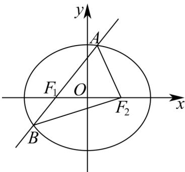

> [!faq]- 《高二数学上学期期中模拟卷_人教A版2019_高效培优_强化卷_》官方解析
>
> > [!success]- **【答案】** A
>
> > [!note]- **【解析】**
> > $NM = NC_{1} + C_{1}C + CM = \frac{2}{3}b - c + \frac{1}{2}\left(a - b\right) = \frac{1}{2}a + \frac{1}{6}b - c$
> >
> > 故选：A
> >
> > $$
> > \frac {x ^ {2}}{4} + \frac {y ^ {2}}{3} = 1
> > $$
> >
> > $$
> > F _ {\mathrm{l}}
> > $$
> >
> > $$
> > A F _ {2}, B F _ {2}
> > $$
> >
> > $$
> > A B F _ {2}
> > $$
> >
> > 周长为（ ）A.8 B.10 C.12 D.14
> >
> > 【答案】A
> >
> > 【详解】椭圆方程 $\frac{x^{2}}{4}+\frac{y^{2}}{3}=1$ ，得： $a^{2}=4$ ，则 a=2。
> >
> > 由椭圆的定义得 $\left|AF_{1}\right|+\left|AF_{2}\right|=2a=4$ ， $\left|BF_{1}\right|+\left|BF_{2}\right|=4$ ，
> >
> > 所以 $\triangle ABF_{2}$ 的周长为 $\left|AB\right| + \left|AF_{2}\right| + \left|BF_{2}\right| = \left|AF_{1}\right| + \left|AF_{2}\right| + \left|BF_{1}\right| + \left|BF_{2}\right| = 8$
> >
> > 故选：A.
> >
> > 
