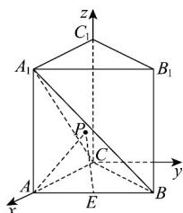

> [!faq]- 《高二数学上学期期中模拟卷_人教A版2019_高效培优_强化卷_》官方解析
>
> > [!success]- **【答案】** C
>
> > [!note]- **【解析】**
> > 以 C 为原点，CA 所在直线为 x 轴，过点 C 且平行于 AB 的直线为 y 轴， $CC_{1}$ 所在直线为 z 轴，建立如图所示的空间直角坐标系 Cxyz ，
> >
> > 
> >
> > 则 $A_{1}(1,0,1)$ ， $B(1,1,0)$ ， $C(0,0,0)$ ， $A(1,0,0)$ ， $E\left(1,\frac{1}{2},0\right)$
> >
> > 所以 $\overset{\square\square\square\square}{CB}=\left(1,1,0\right)$ ， $\overset{\square\square\square\square}{CA}_{1}=\left(1,0,1\right)$ ， $\overset{\square\square\square\square}{AA}_{1}=\left(0,0,1\right)$
> >
> > 设 A 关于平面 $A_{1}BC$ 的对称点为 $A'(x,y,z)$ ，z > 0，
> >
> > 则 $A^{\prime}A_{1} = (1 - x, - y, 1 - z)$ ， $AA' = (x - 1, y, z)$
> >
> > 设平面 $A_{1}BC$ 的法向量 $n = (x_{1},y_{1},z_{1})$ ，则 $\left\{ \begin{array}{l} \square \square \square \\ CB \cdot n = x_1 + y_1 = 0 \\ \square \square \square \\ CA_1 \cdot n = x_1 + z_1 = 0 \end{array} \right.$
> >
> > 令 $x_{1} = 1$ ，则 $y_{1} = -1$ ， $z_{1} = -1$ ，所以 $n = (1, - 1, - 1)$
> >
> > 所以 A 与 $A'$ 到平面 $A_{1}BC$ 的距离 $d=\frac{\left|AA_{1}\cdot n\right|}{\left|n\right|}=\frac{\sqrt{3}}{3}=\frac{\left|A'A_{1}\cdot n\right|}{\left|n\right|}=\frac{\left|-x+y+z\right|}{\sqrt{3}}$
> >
> > 即 $\left|-x+y+z\right|=1$ ①.
> >
> > 又 $AA^{\prime}\parallel n$ ，所以 $\frac{x-1}{1}=\frac{y}{-1}=\frac{z}{-1}$ ，即x-1=-y=-z ②.
> >
> > 由①②得 $\left|3z-1\right|=1$ ，由 $z>0$ 可得 $x=\frac{1}{3}$ ， $y=\frac{2}{3}$ ， $z=\frac{2}{3}$ ，
> >
> > 所以 $A'\left(\frac{1}{3},\frac{2}{3},\frac{2}{3}\right)$
> >
> > $$
> > \left| \stackrel {{\square \sqcup \sqcup}} {P A} \right| + \left| \stackrel {{\square \sqcup \sqcup}} {P E} \right| = \left| \stackrel {{\square \sqcup \sqcup}} {P A ^ {\prime}} \right| + \left| \stackrel {{\square \sqcup \sqcup}} {P E} \right| \quad \left| \stackrel {{\square \sqcup \sqcup}} {A ^ {\prime} E} \right| = \sqrt {\left(\frac {1}{3} - 1\right) ^ {2} + \left(\frac {2}{3} - \frac {1}{2}\right) ^ {2} + \left(\frac {2}{3} - 0\right) ^ {2}} = \sqrt {\frac {4}{9} + \frac {1}{3 6} + \frac {4}{9}} = \frac {\sqrt {3 3}}{6}
> > $$
> >
> > 当且仅当 $A'$ ，P，E 三点共线时取等号，
> >
> > 所以 $\left|PA\right|+\left|PE\right|$ 的最小值为 $\frac{\sqrt{33}}{6}$
> >
> > 故选：C.
> >
> > ## 二、选择题：本题共3小题，每小题6分，共18分．在每小题给出的选项中，有多项符合题目要求．全部选对的得6分，部分选对的得部分分，有选错的得0分.
