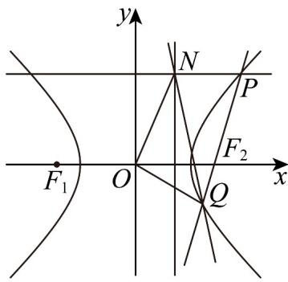

> [!faq]- 《高二数学上学期期中模拟卷_人教A版2019_高效培优_强化卷_》官方解析
>
> > [!success]- **【答案】** (1) $\frac{x^{2}}{2}-\frac{y^{2}}{2}=1$ (2)①证明见解析；② $\frac{3\sqrt{2}}{2}$
>
> > [!note]- **【解析】**
> > （1）由题可知 $\frac{c}{a} = \sqrt{2}, a^2 + b^2 = c^2$ ，则 $a = b, c = \sqrt{2} a$ ，
> >
> > 由 $l \perp x$ 轴时， $\left|PQ\right| = 2\sqrt{2}$ ，可令 $P\left(\sqrt{2}a, \sqrt{2}\right)$
> >
> > 代入双曲线得 $\frac{2a^{2}}{a^{2}}-\frac{2}{b^{2}}=1$
> >
> > 解得 $a^{2}=b^{2}=2$ ，
> >
> > 则所求方程为 $\frac{x^{2}}{2}-\frac{y^{2}}{2}=1$ ;
> >
> > (2) ①证明：设 $P(x_{1}, y_{1}), Q(x_{2}, y_{2})$ ，则 $N(1, y_{1})$
> >
> > 由 $l$ 斜率不为0，可设 $l: x = my + 2$
> >
> > 联立双曲线并整理得 $\left(m^2 - 1\right)y^2 + 4my + 2 = 0$
> >
> > 则 $m^2 - 1 \neq 0$ ， $\Delta = 8m^2 + 8 > 0$
> >
> > 所以 $y_{1} + y_{2} = -\frac{4m}{m^{2} - 1}, y_{1}y_{2} = \frac{2}{m^{2} - 1}$
> >
> > 由 $x_{2} \neq 1$ ，直线 $NQ: y = \frac{y_{2} - y_{1}}{x_{2} - 1}(x - 1) + y_{1}$
> >
> > 根据双曲线的对称性，直线 $NQ$ 所过定点必在 $x$ 轴上，
> >
> > 令 $y = 0$ ，则 $\frac{y_2 - y_1}{x_2 - 1} (x - 1) + y_1 = 0$ $x = \frac{y_2 - y_1x_2}{y_2 - y_1}$
> >
> > 因为 $x_{2} = my_{2} + 2$ ，所以 $x = \frac{y_2 - my_1y_2 - 2y_1}{y_2 - y_1}$
> >
> > 而 $\frac{y_1 + y_2}{y_1y_2} = -2m$ ，所以 $\frac{y_1 + y_2}{2} = -my_1y_2$ ，则 $x = \frac{y_2 + \frac{y_1 + y_2}{2} - 2y_1}{y_2 - y_1} = \frac{3}{2}$
> >
> > 所以 $NQ_{过定点}$ $M\left(\frac{3}{2},0\right)$
> >
> > 
> >
> > $$
> > S _ {\triangle O Q N} = \frac {1}{2} | O M | \left| y _ {1} - y _ {2} \right| = \frac {3}{4} \sqrt {\left(y _ {1} + y _ {2}\right) ^ {2} - 4 y _ {1} y _ {2}} = \frac {3 \sqrt {2}}{2} \cdot \sqrt {\frac {m ^ {2} + 1}{\left(m ^ {2} - 1\right) ^ {2}}}
> > $$
> >
> > 由①得 $\left\{ \begin{array}{ll}m^2 -1\neq 0\\ 8(m^2 +1) > 0\\ y_1y_2 = \frac{2}{m^2 - 1} < 0 \end{array} \right.$ ，解得
> >
> > 令 $t = m^2 - 1 \in [-1, 0)$
> >
> > 则 $S_{\triangle OQN} = \frac{3\sqrt{2}}{2}\cdot \sqrt{\frac{t + 2}{t^2}} = \frac{3\sqrt{2}}{2}\cdot \sqrt{\frac{2}{t^2} + \frac{1}{t}} = \frac{3\sqrt{2}}{2}\cdot \sqrt{2\left(\frac{1}{t} + \frac{1}{4}\right)^2 - \frac{1}{8}}$
> >
> > 因为 $t \in [-1,0)$ ，所以 $\frac{1}{t} \in (-\infty, -1]$ ，则 $S_{\triangle OQN}$ $\frac{3\sqrt{2}}{2}$ ，当 t = -1 时取等号，
> >
> > 所以 $S_{\triangle OQN}$ 的最小值为 $\frac{3\sqrt{2}}{2}$
