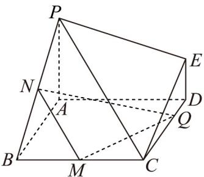

<!-- question-source:start -->
11．如图，在多面体 ABCDEP 中， $PA \perp$ 平面 ABCD．四边形 ABCD 是正方形，且 $DE//PA, PA = AB = 2DE = 2 \quad M, N \quad BC, PB \quad Q \quad DC$ 分别是线段 的中点，是线段 上的一个动点（不含端点 D）

$C$ ），则下列说法错误的是（）

A．不存在点Q，使得异面直线NQ与PE所成的角为 $30^{\circ}$ B．存在点Q，使得 $NQ\perp PB$ C．三棱锥Q-AMN体积的取值范围为 $\left(\frac{1}{3},\frac{2}{3}\right)$ D．当点Q运动到DC中点时，DC与平面QMN所成的余弦值为 $\frac{\sqrt{6}}{6}$
<!-- question-source:end -->

![[高中/课堂同步/题库/人教A版高中数学同步讲义(2026)/03_选择性必修第一册/期中专项训练+期中模拟卷/阶段测试/高二数学上学期期中模拟卷_人教A版_高效培优_提升卷_/一_选择题_sec_02/questions/answers/Q00062632A1.md]]
