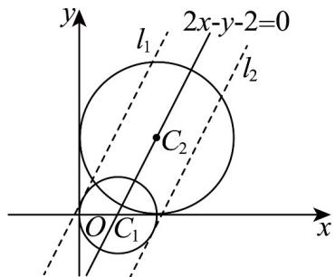

> [!faq]- 《高二数学上学期期中模拟卷_人教A版_高效培优_提升卷_》官方解析
>
> > [!success]- **【答案】** BC
>
> > [!note]- **【解析】**
> > 对于 A，圆 $C_{2}: x^{2} + y^{2} - 4x - 4y + 4 = 0$ 化为标准方程为 $(x - 2)^{2} + (y - 2)^{2} = 4$ ，则圆 $C_{2}$ 的半径为 2，
> >
> > 故A错误.
> >
> > 对于 B，因为圆心 $C_{1}(1,0)$ 到 y 轴的距离为 1，等于圆 $C_{1}$ 的半径，
> >
> > 所以圆 $C_{1}$ 与 y 轴相切，
> >
> > 同理圆心 $C_{2}(2,2)$ 到 y 轴的距离等于圆 $C_{2}$ 的半径，
> >
> > 所以圆 $C_2$ 与 $y$ 轴相切，故 $y$ 轴为圆 $C_1$ 与 $C_2$ 的公切线，故B正确.
> >
> > 对于 C，将 $\left(x-1\right)^{2}+y^{2}=1$ 与 $x^{2}+y^{2}-4x-4y+4=0$ 左右分别相减，得圆 $C_{1}$ 与 $C_{2}$ 的公共弦所在的直线方程
> >
> > 为 $x + 2y - 2 = 0$ ，故 C 正确。
> >
> > 对于 D，如图，
> >
> > 
> >
> > 因为直线 $2x - y - 2 = 0$ 同时经过两圆的圆心，
> >
> > 依题意可作两条与该直线平行且距离为 1 的直线 $l_{1}$ 与 $l_{2}$
> >
> > 其中 $l_{1}$ 与 $l_{2}$ 和圆 $C_{1}$ 都相切，各有一个公共点，
> >
> > $l_{1}$ 与 $l_{2}$ 和圆 $C_{2}$ 都相交，各有两个交点，
> >
> > 故圆 $C_{1}$ 与 $C_{2}$ 上共有 6 个点到直线 2x - y - 2 = 0 的距离为 1，故 D 错误.
> >
> > 故选 **BC**.
