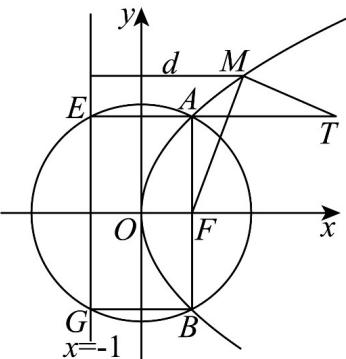

> [!faq]- 《高二数学上学期期中模拟卷_人教A版_高效培优_提升卷_》官方解析
>
> > [!success]- **【答案】** AC
>
> > [!note]- **【解析】**
> > 对于 A，曲线 C 是以 $F(1,0)$ 为焦点，直线 x = -1 为准线的抛物线，方程为 $y^{2} = 4x$ ，A 正确；
> >
> > 对于B，直线 $x = -1$ 交圆 $x^{2} + y^{2} = 5$ 于点 $E(-1,2),G(-1, - 2)$ ，而 $A(1,2),B(1, - 2)$
> >
> > 四边形 AEBG 是矩形，周长为 $2(2+4)=12$ ，B 错误；
> >
> > 
> >
> > 对于C，显然 $T,A,E$ 共线， $TE$ 垂直于直线 $x = -1$ ，令点 $M$ 到直线 $x = -1$ 的距离为 $d$
> >
> > 则 $|MF| = d$ ， $|MT| + |MF| = |MT| + d$ $|TE|$ ，当且仅当 $M$ 与点 $A$ 重合时取等号，
> >
> > 因此 $\left|MT\right|+\left|MF\right|$ 的最小值为 $\left|TE\right|=5$ ，C 正确；
> >
> > 对于D，过点 $N(-1,0)$ 与曲线 $C$ 仅只一个公共点的直线方程为 $y = k(x + 1)$
> >
> > 由 $\left\{ \begin{array}{l} y = k(x + 1) \\ y^2 = 4x \end{array} \right.$ 消去 $x$ 得 $ky^2 - 4y + 4k = 0$ ，当 $k = 0$ 时，直线 $y = 0$ 与抛物线仅中一个公共点，
> >
> > 当 $k \neq 0$ 时， $\Delta = 16 - 16k^2 = 0$ ，解得 $k = \pm 1$ ，显然直线 $y = x + 1, y = -x - 1$ 与抛物线仅只一个公共点，
> >
> > 因此过点 $N(-1,0)$ 与曲线 C 有且只有一个公共点的直线有 3 条，D 错误.
> >
> > 故选 **AC**
