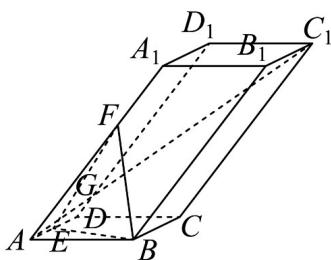

<!-- question-source:start -->
14．如图，在平行六面体 $ABCD - A_1B_1C_1D_1$ 中， $E$ 为 $AD$ 的中点， $AF = 2FA_{1}$ ， $AC_{1}$ 交平面 $BEF$ 为 $G$ ，则

$\frac{AG}{AC_{1}}$ 的值为\_\_\_\_.

<!-- question-source:end -->

![[高中/课堂同步/题库/人教A版高中数学同步讲义(2026)/03_选择性必修第一册/期中专项训练+期中模拟卷/阶段测试/高二数学上学期期中模拟卷_人教A版_高效培优_提升卷_/三_填空题_sec_04/questions/answers/Q00062635A1.md]]
