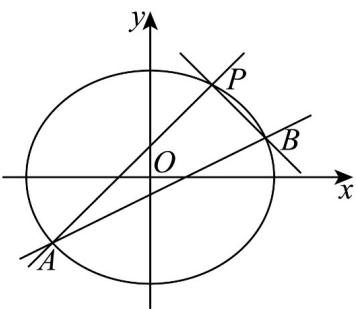

> [!faq]- 《高二数学上学期期中模拟卷_人教A版_高效培优_提升卷_》官方解析
>
> > [!success]- **【答案】** (1) $\frac{x^{2}}{4}+\frac{y^{2}}{3}=1$ (2)(i)是， $\frac{1}{2}$ (ii) $\frac{5\sqrt{21}}{8}$ $$ \left\{e = \frac {c}{a} = \sqrt {1 - \frac {b ^ {2}}{a ^ {2}}} = \frac {1}{2} \right. $$
>
> > [!note]- **【解析】**
> > （1）由题意 $\left\{ \begin{array}{l} \frac{1}{a^2} + \frac{9}{4b^2} = 1 \\ a^2 = 4, b^2 = 3 \end{array} \right.$ ，解得
> >
> > 故所求为 $\frac{x^{2}}{4}+\frac{y^{2}}{3}=1$
> >
> > (2)
> >
> > 
> >
> > (i) 根据题意直线 $AB$ 斜率不为 0，所以设 $l_{AB}: x = my + n$ ， $A(x_1, y_1), B(x_2, y_2)$
> >
> > $$
> > \left\{ \begin{array}{l} \frac {x ^ {2}}{4} + \frac {y ^ {2}}{3} = 1 \\ x = m y + n \end{array} \Rightarrow (3 m ^ {2} + 4) y ^ {2} + 6 m n y + 3 n ^ {2} - 1 2 = 0 \right.
> > $$
> >
> > $$
> > y _ {1} + y _ {2} = \frac {- 6 m n}{3 m ^ {2} + 4}, y _ {1} y _ {2} = \frac {3 n ^ {2} - 1 2}{3 m ^ {2} + 4}
> > $$
> >
> > $$
> > x _ {2} y _ {1} + x _ {1} y _ {2} = 2 m y _ {1} y _ {2} + n \left(y _ {1} + y _ {2}\right) = \frac {- 2 4 m}{3 m ^ {2} + 4}, x _ {1} + x _ {2} = m \left(y _ {1} + y _ {2}\right) + 2 n = \frac {8 n}{3 m ^ {2} + 4},
> > $$
> >
> > $k_{1} + k_{2} = \frac{y_{1} - \frac{3}{2}}{x_{1} - 1} +\frac{y_{2} - \frac{3}{2}}{x_{2} - 1} = \frac{\left(y_{1} - \frac{3}{2}\right)(x_{2} - 1) + \left(y_{2} - \frac{3}{2}\right)(x_{1} - 1)}{(x_{1} - 1)(x_{2} - 1)}$ $= \frac{x_2y_1 + x_1y_2 - (y_1 + y_2) - \frac{3}{2}(x_1 + x_2) + 3}{(x_1 - 1)(x_2 - 1)}$ $= \frac{-24m + 6mn - 12n + 9m^2 + 12}{(x_1 - 1)(x_2 - 1)(3m^2 + 4)}$ $= \frac{(3m + 2n - 2)(3m - 6)}{(x_1 - 1)(x_2 - 1)(3m^2 + 4)} = 0,$
> >
> > 当 $3m + 2n - 2 = 0$ ，此时直线 $AB$ 过点 $P\left(1,\frac{3}{2}\right)$ ，故舍去，即 $3m - 6 = 0 \Rightarrow m = 2$
> >
> > 所以直线方程为 $x = 2y + n$ ，即 $y = \frac{1}{2} x - \frac{n}{2}$
> >
> > 所以直线 AB 的斜率是定值，等于 $\frac{1}{2}$ .
> >
> > （ii）由（i）得直线 $AB$ 方程为 $y = \frac{1}{2} x - \frac{n}{2}$ ，又直线 $AB$ 的纵截距不大于 $-\frac{3}{2}$ ，
> >
> > 所以 $-\frac{n}{2} \leq -\frac{3}{2}$ ，解得 $n = 3$ ，又 $\Delta = (6mn)^2 - 4(3n^2 - 12)(3m^2 + 4) = -48(n^2 - 16) > 0$ ，
> >
> > 所以 $3 \leq n < 4$
> >
> > $$
> > \left| A B \right| = \sqrt {1 + m ^ {2}} \cdot \sqrt {\left(y _ {1} + y _ {2}\right) ^ {2} - 4 y _ {1} y _ {2}} = \sqrt {1 + m ^ {2}} \cdot \frac {4 \sqrt {3} \cdot \sqrt {- n ^ {2} + 3 m ^ {2} + 4}}{3 m ^ {2} + 4} = \frac {\sqrt {1 5} \cdot \sqrt {1 6 - n ^ {2}}}{4},
> > $$
> >
> > 又点 $P\left(1,\frac{3}{2}\right)$ 到直线的距离 $d=\frac{|n+2|}{\sqrt{5}}$
> >
> > $$
> > S _ {\triangle A B P} = \frac {1}{2} | A B | d = \frac {1}{2} \cdot \frac {\sqrt {1 5} \cdot \sqrt {1 6 - n ^ {2}}}{4} \cdot \frac {| n + 2 |}{\sqrt {5}} = \frac {\sqrt {3}}{8} \sqrt {- n ^ {4} - 4 n ^ {3} + 1 2 n ^ {2} + 6 4 n + 6 4}
> > $$
> >
> > $$
> > \text {令} f (n) = - n ^ {4} - 4 n ^ {3} + 1 2 n ^ {2} + 6 4 n + 6 4, 3 \leq n <   4
> > $$
> >
> > $$
> > f ^ {\prime} (n) = - 4 n ^ {3} - 1 2 n ^ {2} + 2 4 n + 6 4 = - 4 (n + 2) (n ^ {2} + n - 8)
> > $$
> >
> > 所以当 $f^{\prime}(n) = 0$ 时，解得 $n = -2$ 或 $n = \frac{-1 - \sqrt{33}}{2} < -2$ 或 $n = \frac{-1 + \sqrt{33}}{2} < 3$
> >
> > 即当 $3 \leq n < 4$ 时， $f'(n) < 0$ ， $f(n)$ 单调递减， $f(n)_{\max} = f(3) = 175$
> >
> > 即 $\left[S_{\triangle ABP}\right]_{\max} = \frac{\sqrt{3}}{8}\cdot \sqrt{175} = \frac{5\sqrt{21}}{8}$
> >
> > 所以 $\triangle ABP$ 面积的最大值 $\frac{5\sqrt{21}}{8}$
