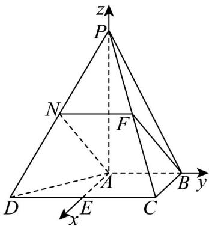

> [!faq]- 《高二数学上学期期中模拟卷_人教A版_高效培优_提升卷_》官方解析
>
> > [!success]- **【答案】** (1)证明见解析(2) 5 (3) 5 $$ \frac {\sqrt {1 0}}{5} \quad (3) \frac {\sqrt {5}}{5} $$
>
> > [!note]- **【解析】**
> > （1）设PC的中点为F，连接NF、BF，
> >
> > 因为 $N$ 为 $PD$ 的中点，所以 $NF // CD$ ，且 $NF = \frac{1}{2} DC$
> >
> > 又 $AB // CD$ ，且 $AB = \frac{1}{2} CD$ ，所以 $NF // AB$ ，且 $NF = AB$ ，
> >
> > 所以四边形 ANFB 为平行四边形，则 AN//BF，
> >
> > 又 $AN \notin$ 平面 $PBC$ , $BF \subset$ 平面 $PBC$ , 所以 $AN //$ 平面 $PBC$ .
> >
> > (2) 记 $CD$ 的中点为 $E$ , 连接 $AE$ ,
> >
> > 因为 $AB \parallel CD$ ， $CE = \frac{1}{2}CD = 1 = AB$ ， $AB \perp BC$ ，
> >
> > 所以四边形 $ABCE$ 是矩形，则 $AE = BC = 1$ ， $AE \perp AB$ ，
> >
> > 以 A 为原点，以 AE、AB、AP 所在直线为 x、y、z 轴建立空间直角坐标系，如图，
> >
> > 
> >
> > 则 $A(0,0,0)$ 、 $D(1, - 1,0)$ 、 $C(1,1,0)$ 、 $P(0,0,2)$
> >
> > 则 $\overset{\text{UUU}}{CD} = (0, -2, 0) \quad , \quad \overset{\text{UUU}}{PD} = (1, -1, -2) \quad , \quad \overset{\text{UUU}}{AP} = (0, 0, 2)$
> >
> > 设平面 PAD 的一个法向量为 $n = (a, b, c)$ ,
> >
> > 所以 $\left\{\begin{aligned}&\square\square\square\square\\&AP\cdot n=2c=0\\&\square\square\square\square\\&PD\cdot n=a-b-2c=0\end{aligned}\right.$ ，令 $a=1$ ，则 $n=(1,1,0)$ ，
> >
> > 设平面 $PCD$ 的一个法向量为 $u = (r, s, t)$
> >
> > 所以 $\left\{\begin{aligned}CD&\cdot u=-2s=0\\ PD&\cdot u=r-s-2t=0\end{aligned}\right.$ ，令 $t=1$ ，则 $u=(2,0,1)$ ，
> >
> > 所以 $\cos n, u = \frac{n \cdot u}{|n| \cdot |u|} = \frac{2}{\sqrt{2} \times \sqrt{5}} = \frac{\sqrt{10}}{5}$
> >
> > 由图可知，二面角 $C - PD - A$ 为锐角，所以二面角 $C - PD - A$ 的余弦值为 $\frac{\sqrt{10}}{5}$
> >
> > (3) 依题意，设 $M(0,0,k)(0 \leq k \leq 2)$ ，则 $CM = (-1, -1,k)$
> >
> > 又由（2）得平面 PAD 的一个法向量为 $n = (1, 1, 0)$
> >
> > 记直线 CM 与平面 PAD 所成角为 $\beta$ ，
> >
> > 所以 $\sin\beta=\left|\cos n,CM\right|=\frac{\left|n\cdot CM\right|}{\left|n\right|\cdot\left|CM\right|}=\frac{2}{\sqrt{2}\cdot\sqrt{2+k^{2}}}=\frac{\sqrt{6}}{3}$ ，解得 k=1 （负值舍去），
> >
> > 所以 $M(0,0,1)$ ，则 $MP=(0,0,1)$
> >
> > 而由（2）得平面 $PCD$ 的一个法向量为 $u = (2,0,1)$
> >
> > 所以点 $M$ 到平面 $PCD$ 的距离为 $\frac{\left|\overrightarrow{MP} \cdot u\right|}{\left|u\right|} = \frac{1}{\sqrt{5}} = \frac{\sqrt{5}}{5}$ .
