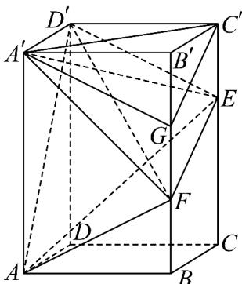

<!-- question-source:start -->
11．如图所示，在长方体 $ABCD - A'B'C'D'$ 中， $AA' = 6, AB = 4, AD = 3$ ，E，F 分别在棱 $CC'$ 和 $BB'$ 上，

$C^{\prime}E=\frac{1}{2}CE$ ， $FE=B^{\prime}C^{\prime}+BF$ ，则下列说法正确的是（）

A. $V_{D^{\prime} - AEF}\neq V_{F - A^{\prime}AE}$

B．直线 EF 与 AD 所成角的余弦值为 $\frac{3\sqrt{13}}{13}$

$$
2 \sqrt {3}
$$

C．直线 $AD'$ 和平面 $BB'D'D$ 所成角的正弦值为 21

D．若G为线段 $B^{\prime}F$ 的中点，则直线 $D^{\prime}F//$ 平面 $A^{\prime}GC^{\prime}$
<!-- question-source:end -->

![[高中/课堂同步/题库/人教A版高中数学同步讲义(2026)/03_选择性必修第一册/期中专项训练+期中模拟卷/高二数学上学期期中模拟卷（人教A版2019选择性必修第一册全部空间向量与立体几何+直线和圆+圆锥曲线，高效培优·强化卷）/一_选择题/questions/answers/Q00079645A1.md]]
