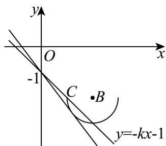

> [!faq]- 《高二数学上学期期中模拟卷（人教A版2019选择性必修第一册全部空间向量与立体几何+直线和圆+圆锥曲线，高效培优·强化卷）》官方解析
>
> > [!success]- **【答案】** A
>
> > [!note]- **【解析】**
> > $y = kx - 1$ 关于直线 $y = -1$ 的对称直线为 $y = -kx - 1$
> >
> > 则题设等价于函数 $f(x) = -\sqrt{4x - x^2 - 3} - 2$ 的图象和 $y = -kx - 1$ 的图象有两个交点.令 $y = f(x) = -\sqrt{4x - x^2 - 3} - 2$ 等价于 $(x - 2)^2 + (y + 2)^2 = 1(y \leq -2)$ ，
> >
> > 设直线 y = -kx - 1 和 $y = f(x)$ 相切，
> > 由 $\frac{\left|-2k+2-1\right|}{\sqrt{k^{2}+1}}=1$ ，解得 $k=\frac{4}{3}$ 或 k=0（舍），
> > 又当直线 $y = -kx - 1$ 过点 $C(1, -2)$ 时，解得 k = 1，
> > 所以 k 的取值范围是 $\left[1, \frac{4}{3}\right)$ .
> >
> > 
> >
> > 故选 **A**.
