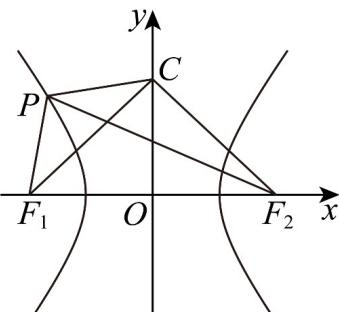

> [!faq]- 《高二数学上学期期中模拟卷（人教A版2019选择性必修第一册全部空间向量与立体几何+直线和圆+圆锥曲线，高效培优·强化卷）》官方解析
>
> > [!success]- **【答案】** ABD
>
> > [!note]- **【解析】**
> > 双曲线 $E:\frac{x^{2}}{a^{2}}-\frac{y^{2}}{3}=1(a>0)$ 的渐近线方程为 $y=\pm\frac{\sqrt{3}}{a}x$ ，即 $\sqrt{3}x\pm ay=0$
> >
> > 由圆 $C:x^{2} + (y - 2)^{2} = 1$ ，圆心为 $C(0,2)$ ，半径为 $r = 1$
> >
> > 因为渐近线与圆 C 相切，所以 $\frac{|2a|}{\sqrt{3+a^{2}}}=1$ ，解得 a=1，故 A 正确；
> >
> > 而 $b^{2} = 3$ ，则 $c^2 = a^2 +b^2 = 4$ ，即 $c = 2$ ，所以 $F_{1}(-2,0),F_{2}(2,0)$
> >
> > 则 $\left|CF_1\right| = \left|CF_2\right| = 2\sqrt{2},\left|F_1F_2\right| = 4$ ，故 $\left|CF_1\right|^2 +\left|CF_2\right|^2 = \left|F_1F_2\right|^2$ ，即 $CF_{1}\bot CF_{2}$
> >
> > 所以 $\triangle CF_1F_2$ 为等腰直角三角形，故B正确； $\triangle CF_2P$ 的周长为 $|CF_2| + |PC| + |PF_2| = 2\sqrt{2} + |PC| + 2a + |PF_1| = 2\sqrt{2} + 2 + |PC| + |PF_1|$ $2\sqrt{2} + 2 + |CF_1| = 4\sqrt{2} + 2$
> >
> > 当且仅当 $P, C, F_{1}$ 三点共线时等号成立，
> >
> > 则 $\Delta CF_{2}P$ 的周长的最小值为 $4\sqrt{2} + 2$ ，故C不正确；
> >
> > 设 $P\left(x_0,y_0\right),x_0\leq -1,y_0\in \mathbb{R}$ ，则 $x_0^2 -\frac{y_0^2}{3} = 1$ ，即 $x_0^2 = 1 + \frac{y_0^2}{3}$
> >
> > 所以 $\left|CP\right|=\sqrt{x_{0}^{2}+\left(y_{0}-2\right)^{2}}=\sqrt{1+\frac{y_{0}^{2}}{3}+y_{0}^{2}-4y_{0}+4}=\sqrt{\frac{4}{3}\left(y_{0}-\frac{3}{2}\right)^{2}+2}$
> >
> > 则 $y_{0}=\frac{3}{2}$ 时， $\left|CP\right|$ 取得最小值 $\sqrt{2}$ ，故 D 正确.
> >
> > 故选：ABD.
> >
> > 
