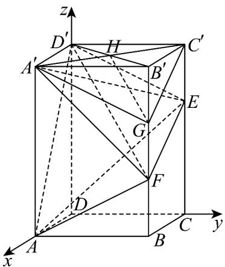

> [!faq]- 《高二数学上学期期中模拟卷（人教A版2019选择性必修第一册全部空间向量与立体几何+直线和圆+圆锥曲线，高效培优·强化卷）》官方解析
>
> > [!success]- **【答案】** ABD
>
> > [!note]- **【解析】**
> > 对于 A，因为 $FE = FB + BC + CE$ ，又 $FE = B'C' + BF$ ，所以 $FB + BC + CE = B'C' + BF$ ， $BC = B'C'$ ，所以 $CE = 2BF$ ，
> >
> > 又 $C^{\prime}E = \frac{1}{2} CE$ ， $CE = \frac{2}{3} CC^{\prime}$ ， $BB^{\prime} = CC^{\prime}$ ，所以 $BF = \frac{1}{3} BB^{\prime}$
> >
> > 综上可知， $E,F$ 分别为所在棱的三等分点，
> >
> > 以 $D$ 为原点， $DA, DC, DD'$ 所在直线分别为 $x, y, z$ 轴，建立如图所示的空间直角坐标系，
> >
> > 则 $E(0,4,4),F(3,4,2),A(3,0,0),D(0,0,0)$ ， $D^{\prime}(0,0,6),C(0,4,0),B(3,4,0)$
> >
> > 所以 $EF = (3, 0, -2)$ , $AF = (0, 4, 2)$ , $D'A' = DA = (3, 0, 0)$
> >
> > 设平面 AEF 的法向量为 $n = (a, b, c)$ ,
> >
> > 则 $\left\{\begin{aligned}EE&\cdot n=3a-2c=0\\ AF&\cdot n=4b+2c=0\end{aligned}\right.$ ，取 $a=2$ ，则 $n=\left(2,-\frac{3}{2},3\right)$ ，
> >
> > 所以 $D^{\prime}A^{\prime}\cdot n=6$ ，所以直线 $A^{\prime}D^{\prime}$ 不平行于平面 AEF，
> >
> > 所以 $A', D'$ 两点到平面 AEF 的距离不相等，所以 $V_{D'-AEF} \neq V_{A'-AEF} = V_{F-A'AE}$ ，故 A 正确；
> >
> > 对于 B， $EF = (3, 0, -2)$ ， $DA = (3, 0, 0)$
> >
> > 
> >
> > 则直线 $_{EF}$ 与 $_{AD}$ 所成角的余弦值为 $\left|\cos EF, DA\right|=\frac{\left|\overrightarrow{EF}\cdot\overrightarrow{DA}\right|}{\left|EF\right|\left|DA\right|}=\frac{9}{3\sqrt{13}}=\frac{3\sqrt{13}}{13}$ ，故B正确；
> >
> > 对于 C， $AD' = (-3, 0, 6)$ ， $DD' = (0, 0, 6)$ ， $DB = (3, 4, 0)$
> >
> > 设平面 $BB^{\prime}D^{\prime}D$ 的一个法向量为 $\stackrel{\square}{m} = (x,y,z)$ ，则 $\left\{ \begin{array}{l} D D^{\prime} \cdot m = 6z = 0 \\ D B \cdot m = 3x + 4y = 0 \end{array} \right.$ ，
> >
> > 取 $x = -4$ ，得平面 $BB^{\prime}D^{\prime}D$ 的一个法向量为 $m = (-4,3,0)$
> >
> > 设直线 $AD'$ 与平面 $BB'D'D$ 所成的角为 $\theta$ ，
> >
> > 则 $\sin\theta=\left|\cos AD^{\prime},m\right|=\frac{\left|AD^{\prime}\cdot m\right|}{\left|AD^{\prime}\right|\left|m\right|}=\frac{12}{\sqrt{45}\times\sqrt{25}}=\frac{4\sqrt{5}}{25}$
> >
> > 所以直线 $AD'$ 和平面 $BB'D'D$ 所成角的正弦值为 25，故 C 错误；
> >
> > $$
> > \frac {4 \sqrt {5}}{2 5}
> > $$
> >
> > 对于 D，连接 $B^{\prime}D^{\prime}$ ，交 $A^{\prime}C^{\prime}$ 于点 H，连接 HG，
> >
> > 因为 $A'B'C'D'$ 为矩形，所以 H 是 $B'D'$ 的中点，
> >
> > 有 G 为 $B'F$ 的中点，所以 $D'F // HG$ ，
> >
> > 又 $D'F \not\subset$ 平面 $A'GC'$ ， $HG \subset$ 平面 $A'GC'$ ，从而 $D'F //$ 平面 $A'GC'$ ，故 D 正确.
