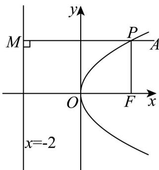
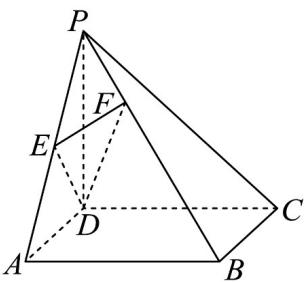
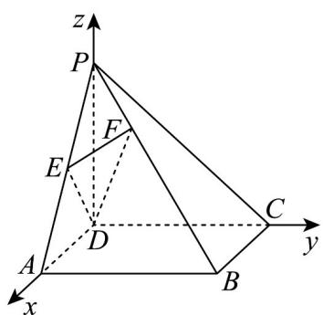

> [!faq]- 《高二数学上学期期中模拟卷（人教A版2019选择性必修第一册全部空间向量与立体几何+直线和圆+圆锥曲线，高效培优·强化卷）》官方解析
>
> > [!success]- **【答案】** 6
>
> > [!note]- **【解析】**
> > 根据题意，过点 P 作 PM 垂直准线于点 M ，如图所示：
> >
> > 
> >
> > 根据抛物线的定义，抛物线上的点到抛物线 $y^{2}=8x$ 的焦点 F 的距离等于到它的准线 x=-2 的距离，
> > 所以 $\left|PF\right|+\left|PA\right|=\left|PM\right|+\left|PA\right|$ ，当 A, P, M 三点共线时取得最小值，
> >
> > 所以 $\left|PF\right|+\left|PA\right|$ 的最小值为6.
> >
> > 故答案为：6.
> >
> > 14．《九章算术》是我国古代数学名著，书中将底面为矩形，且有一条侧棱垂直于底面的四棱锥称为“阳
> >
> > 马”。如图，在阳马 $P - ABCD$ 中， $PD \perp$ 底面 $ABCD$ ，底面 $ABCD$ 是矩形， $AB = 2AD = 4$ ， $PD = \frac{4\sqrt{5}}{5}$ ， $E$
> >
> > 是 $PA$ 的中点， $\overline{FB} = 2\overline{PF}$ 。若点 $M$ 在矩形 $ABCD$ 内，且 $PM \perp$ 平面 $DEF$ ，则 $DM = \_$ 。
> >
> > 
> >
> > 【答案】 $\frac{4\sqrt{5}}{5} / \frac{4}{5}\sqrt{5}$
> >
> > 【详解】如图，以 $D$ 为坐标原点， $\overline{DA}, \overline{DC}, \overline{DP}$ 的方向分别为 $x, y, z$ 轴的正方向，建立空间直角坐标系，
> >
> > 
> >
> > 则 $D(0,0,0)$ ， $P\left(0,0,\frac{4\sqrt{5}}{5}\right)$ ， $E\left(1,0,\frac{2\sqrt{5}}{5}\right)$ ， $F\left(\frac{2}{3},\frac{4}{3},\frac{8\sqrt{5}}{15}\right)$ ， $\overrightarrow{DE} = \left(1,0,\frac{2\sqrt{5}}{5}\right)$ ， $\overrightarrow{DF} = \left(\frac{2}{3},\frac{4}{3},\frac{8\sqrt{5}}{15}\right)$
> >
> > 设平面 的法向量为 ，则 $\left\{\begin{aligned}&\rightarrow\quad\text{回回} \\&n\cdot DE=x+\frac{2\sqrt{5}}{5}z=0\\&\rightarrow\quad\text{回回} \\&n\cdot DF=\frac{2}{3}x+\frac{4}{3}y+\frac{8\sqrt{5}}{15}z=0\end{aligned}\right.$
> >
> > 令 $z = \sqrt{5}$ ，得 $n = (-2, - 1,\sqrt{5})$
> >
> > 设 $M(m,n,0)$ ，则 $\overrightarrow{PM} = \left(m,n, - \frac{4\sqrt{5}}{5}\right)$
> >
> > 因为 平面 ，所以 ，则 $\frac{m}{-2}=\frac{n}{-1}=\frac{-\frac{4\sqrt{5}}{5}}{\sqrt{5}}$ ，解得 $m=\frac{8}{5}$ ， $n=\frac{4}{5}$
> >
> > 所以 $M\left(\frac{8}{5},\frac{4}{5},0\right)$ ， $\overrightarrow{DM}=\left(\frac{8}{5},\frac{4}{5},0\right)$ ，故 $DM=\left|\overrightarrow{DM}\right|=\sqrt{\left(\frac{8}{5}\right)^{2}+\left(\frac{4}{5}\right)^{2}}=\frac{4\sqrt{5}}{5}$
> >
> > 故答案为： $\frac{4\sqrt{5}}{5}$
