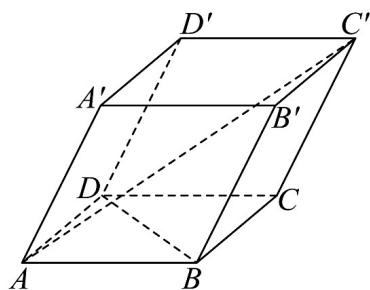

<!-- question-source:start -->
16. (15 分)

如图，在平行六面体 $ABCD - A'B'C'D'$ 中， $AB = AD = 2$ ， $AA' = 3$ ， $\angle BAD = 90^\circ$ ， $\angle BAA' = \angle DAA' = 60^\circ$

(1)求证： $BD \perp AC'$ ;

(2)求 $AC'$ 的长.
<!-- question-source:end -->

![[高中/课堂同步/题库/人教A版高中数学同步讲义(2026)/03_选择性必修第一册/期中专项训练+期中模拟卷/高二数学上学期期中模拟卷（人教A版2019选择性必修第一册全部空间向量与立体几何+直线和圆+圆锥曲线，高效培优·强化卷）/四_解答题/questions/answers/Q00079649A1.md]]
