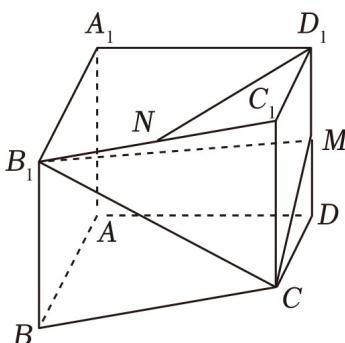

<!-- question-source:start -->
18. (17 分)

已知四棱柱 $ABCD - A_{1}B_{1}C_{1}D_{1}$ 中，底面 ABCD 为梯形，AB // CD ， $A_{1}A \perp$ 平面 ABCD ， $AD \perp AB$ ，其中

$AB = A_{1}A = 2$ ， $AD = DC = 1$ . $M$ 是 $DD_{1}$ 上的一动点， $N$ 是 $B_{1}C_{1}$ 上的一动点.

(1)当 $D_{1}M$ 的长是多少时，平面 $CB_{1}M_{\perp}$ 平面 $AA_{1}D_{1}D$ ，请说明理由；

(2)当 $M$ 是 $DD_{1}$ 的中点时，求点 $B$ 到平面 $CB_{1}M$ 的距离；

(3)若 $M$ 是 $DD_{1}$ 的中点，且 $D_{1}N / /$ 平面 $CB_{1}M$ 时，求三棱锥 $N - B_{1}MC$ 的体积.
<!-- question-source:end -->

![[高中/课堂同步/题库/人教A版高中数学同步讲义(2026)/03_选择性必修第一册/期中专项训练+期中模拟卷/高二数学上学期期中模拟卷（人教A版2019选择性必修第一册全部空间向量与立体几何+直线和圆+圆锥曲线，高效培优·强化卷）/四_解答题/questions/answers/Q00079651A1.md]]
