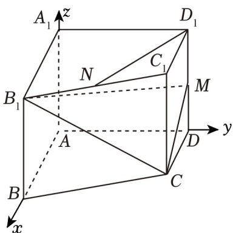

> [!faq]- 《高二数学上学期期中模拟卷（人教A版2019选择性必修第一册全部空间向量与立体几何+直线和圆+圆锥曲线，高效培优·强化卷）》官方解析
>
> > [!success]- **【答案】** (1)2，理由见解析(2) $\frac{2\sqrt{11}}{11}$ (3) $\frac{1}{6}$
>
> > [!note]- **【解析】**
> > （1）当 $D_{1}M = 2$ 时，平面 $CB_{1}M_{\perp}$ 平面 $AA_{1}D_{1}D$ ，理由如下：
> >
> > 由题意知， $AB,AD,AA_{1}$ 两两垂直，故以 $A$ 为原点建立如图所示的空间直角坐标系，
> >
> > 
> >
> > 则 $C(1,1,0),B_1(2,0,2),C_1(1,1,2),D_1(0,1,2)$ ，所以 $\overline{CB_1} = (1, - 1,2)$
> >
> > 设 $M(0,1,t)$ ，则 $\overline{CM} = (-1,0,t)$
> >
> > 设平面 $CB_{1}M$ 的法向量为 $n=(x,y,z)$
> >
> > 则 $\left\{ \begin{array}{l} n \perp \overrightarrow{CB} \\ n \perp CM \end{array} \right. \Rightarrow \left\{ \begin{array}{l} n \cdot \overrightarrow{CB} = x - y + 2z = 0 \\ n \cdot CM = -x + tz = 0 \end{array} \right.$
> >
> > 取 $z = 1$ ，则 $x = t, y = t + 2$ ，所以 $n = (t, t + 2, 1)$
> >
> > 易知平面 $AA_{1}D_{1}D$ 的一个法向量为 $m=(1,0,0)$
> >
> > 因为平面 $CB_{1}M_{\perp \text{平面}}AA_{1}D_{1}D$ ，所以 $\stackrel{\square}{m}\cdot n = (1,0,0)\cdot (t,t + 2,1) = t = 0$
> >
> > 即 $M(0,1,0)$
> >
> > 所以当 $D_{1}M = 2$ 时，平面 $CB_{1}M \perp$ 平面 $AA_{1}D_{1}D$
> >
> > (2) 当 M 是 $DD_{1}$ 的中点时， $M(0,1,1)$ ，即 t=1，
> >
> > 所以平面 $CB_{1}M$ 的法向量为 $n = (t,t + 2,1) = (1,3,1)$ ，而 $\overline{BB_1} = (0,0,2)$
> >
> > 所以点 $B$ 到平面 $CB_{1}M$ 的距离为 $\frac{\left|\overline{BB}_{\perp}\cdot n\right|}{\left|n\right|} = \frac{2}{\sqrt{11}} = \frac{2\sqrt{11}}{11}$
> >
> > (3) 当 M 是 $DD_{1}$ 的中点时， $M(0,1,1)$ ，平面 $CB_{1}M$ 的法向量为 $n=(1,3,1)$ ，
> >
> > 设 $\overline{C_1N} = \lambda \overline{C_1B_1} = \lambda (1, - 1,0)$ ， $\lambda \in [0,1]$ ，所以 $D_{1}N = D_{1}C_{1} + C_{1}N = (1 + \lambda , - \lambda ,0)$
> >
> > 因为 $D_{1}N / /$ 平面 $CB_{1}M$ ，所以 $\overline{D_1N}\cdot n = (1 + \lambda , - \lambda ,0)\cdot (1,3,1) = 1 + \lambda -3\lambda = 0$
> >
> > 解得 $\lambda=\frac{1}{2}$ ，即点 N 是 $B_{1}C_{1}$ 的中点，
> >
> > 所以 $N\left(\frac{3}{2},\frac{1}{2},2\right)$ ， $CN=\left(\frac{1}{2},-\frac{1}{2},2\right)$
> >
> > 所以点 $N$ 到平面 $CB_{1}M$ 的距离 $d = \frac{\left|\overrightarrow{CN}\cdot n\right|}{\left|n\right|} = \frac{\left|\left(\frac{1}{2}, - \frac{1}{2}, 2\right) \cdot (1,3,1)\right|}{\sqrt{1 + 9 + 1}} = \frac{\sqrt{11}}{11}$
> >
> > 因为 $C(1,1,0)$ , $B_{1}(2,0,2)$ , $M(0,1,1)$ ，所以 $CB_{1}=\sqrt{6}$ ， $CM=\sqrt{2}$ ， $MB_{1}=\sqrt{6}$
> >
> > 所以 $\triangle CB_{1}M$ 的面积 $S = \frac{1}{2} CM\cdot \sqrt{\left(B_{1}M\right)^{2} - \left(\frac{1}{2} CM\right)^{2}} = \frac{\sqrt{11}}{2}$
> >
> > 所以三棱锥 $N - B_{1}MC$ 的体积 $V = \frac{1}{3} S\cdot d = \frac{1}{3}\times \frac{\sqrt{11}}{2}\times \frac{\sqrt{11}}{11} = \frac{1}{6}$
