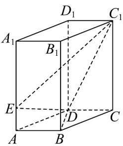

<!-- question-source:start -->
8．如图所示，在直四棱柱 $ABCD-A_{1}B_{1}C_{1}D_{1}$ 中，底面 ABCD 为平行四边形， $BD \perp DC$ ，BD = DC = 1，点

$E$ 在棱 $AA_{1}$ 上，且 $AE = \frac{1}{4} AA_{1} = \frac{1}{2}$ ，则点 $B$ 到平面 $EDC_{1}$ 的距离为（）

A. $\frac{\sqrt{5}}{7}$ B. $\frac{\sqrt{2}}{4}$ C. $\frac{\sqrt{5}}{3}$ D. $\frac{\sqrt{2}}{2}$
<!-- question-source:end -->

![[高中/课堂同步/题库/人教A版高中数学同步讲义(2026)/03_选择性必修第一册/期中专项训练+期中模拟卷/高二数学上学期期中模拟卷（人教A版选择性必修第一册全部空间向量与立体几何+直线和圆+圆锥曲线，高效培优·提升卷）/一_选择题/questions/answers/Q00079658A1.md]]
