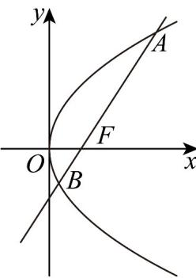

> [!faq]- 《高二数学上学期期中模拟卷（人教A版选择性必修第一册全部空间向量与立体几何+直线和圆+圆锥曲线，高效培优·提升卷）》官方解析
>
> > [!success]- **【答案】** A. $\frac{\sqrt{3}}{3}$ B. $\sqrt{3}$ C. $\frac{\sqrt{2}}{2}$ D. $\sqrt{2}$
>
> > [!note]- **【解析】**
> > 依题意 $F(1,0)$ ，设直线 $AB$ 的方程为 $x = my + 1 (m > 0)$
> >
> > 由 $\left\{\begin{aligned}y^{2}&=4x\\ x&=my+1\end{aligned}\right.$ ，得 $y^{2}-4my-4=0$ ，所以 $y_{A}+y_{B}=4m$ ，
> >
> > 所以 $\left|AB\right|=x_{A}+x_{B}+p=m\left(y_{A}+y_{B}\right)+2+2=4m^{2}+4=\frac{16}{3}$ ，解得 $m=\frac{\sqrt{3}}{3}$
> >
> > 所以直线 l 的斜率为 $\sqrt{3}$ .
> >
> > 
> >
> > 故选：B.
> >
> > 6. 椭圆 $\frac{x^2}{25} + \frac{y^2}{9} = 1$ 的离心率与双曲线 $\frac{x^2}{a^2} - \frac{y^2}{b^2} = 1 (a > 0, b > 0)$ 的离心率之积为 1，点 $P$ 是两曲线在第一象限
> >
> > 的交点，则点 $P$ 的横坐标可能为（ ）A.2 B.2.5 C.3 D.4
> >
> > 【答案】D
> >
> > 【详解】椭圆离心率 $e_{1}=\frac{4}{5}$ ，所以双曲线离心率 $e_{2}=\frac{5}{4}$ ，则渐近线方程为 $y=\pm\frac{3}{4}x$ 联立椭圆方程，得 $x^{2}+\frac{25}{9}\times\frac{9}{16}x^{2}=25\Rightarrow x^{2}=\frac{400}{41}\approx9.76$ 由渐近线与双曲线位置关系，它们与椭圆在第一象限交点 P 横坐标有 $x^{2}<x_{P}^{2}$ ，
> > 所以，只有 $x_{P}=4$ 满足.
> >
> > 故选 **D**
