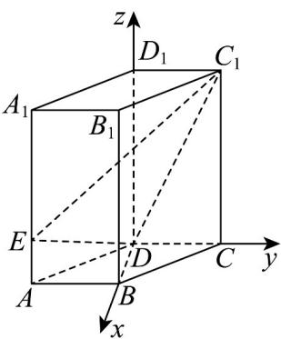

> [!faq]- 《高二数学上学期期中模拟卷（人教A版选择性必修第一册全部空间向量与立体几何+直线和圆+圆锥曲线，高效培优·提升卷）》官方解析
>
> > [!success]- **【答案】** C
>
> > [!note]- **【解析】**
> > 
> >
> > 建立如图所示的空间直角坐标系，则 $D(0,0,0)$ ， $A(1, - 1,0)$ ， $B(1,0,0)$ ， $C(0,1,0)$ ， $C_1(0,1,2)$ ， $E\left(1, - 1,\frac{1}{2}\right)$ ， $\therefore \stackrel {\square \square \square \square}{DC}_{1} = (0,1,2)$ ， $\stackrel {\square \square \square}{DE} = \left(1, - 1,\frac{1}{2}\right)$ ， $\stackrel {\square \square \square}{DB} = (1,0,0)$
> >
> > 设平面 $EDC_{1}$ 的法向量为 $n=(x,y,z)$ ，则 $\left\{\begin{aligned}\vec{D} & \vec{E} \cdot n = x - y + \frac{1}{2}z = 0\\ \vec{D} & C_{1} \cdot n = y + 2z = 0\end{aligned}\right.$
> >
> > 令 $z = 1$ ，则 $x = -\frac{5}{2}$ ， $y = -2$ $\vec{n} = \left(-\frac{5}{2}, - 2,1\right)$
> >
> > ∴点 B 到平面 $EDC_{1}$ 的距离 $d=\frac{\left|\begin{matrix}\vec{n}\cdot\vec{D}B\\n\end{matrix}\right|}{\left|\begin{matrix}n\end{matrix}\right|}=\frac{\frac{5}{2}}{\frac{3\sqrt{5}}{2}}=\frac{\sqrt{5}}{3}$
> >
> > 故选：C
> >
> > ## 二、选择题：本题共3小题，每小题6分，共18分．在每小题给出的选项中，有多项符合题目要求．全部选对的得6分，部分选对的得部分分，有选错的得0分.
