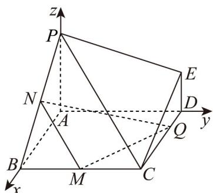
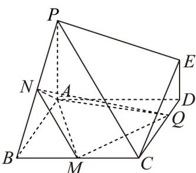

> [!faq]- 《高二数学上学期期中模拟卷（人教A版选择性必修第一册全部空间向量与立体几何+直线和圆+圆锥曲线，高效培优·提升卷）》官方解析
>
> > [!success]- **【答案】** BD
>
> > [!note]- **【解析】**
> > 以 $A$ 为坐标原点，分别以 $AB, AD, AP$ 所在直线为 $x, y, z$ 轴，建立如图所示空间直角坐标系，
> >
> > 
> >
> > 则 $A(0,0,0),B(2,0,0),C(2,2,0),D(0,2,0),E(0,2,1),P(0,0,2),N(1,0,1),M(2,1,0)$
> >
> > 对于 A，假设存在点 $Q(m,2,0)(0<m<2)$ ，使得异面直线 NQ 与 PE 所成的角为 $30^{\circ}$
> >
> > 因为 $NQ = (m - 1, 2, -1)$ ， $PE = (0, 2, -1)$ ，
> >
> > 所以 $\left|\cos NQ, PE\right|=\frac{\left|\overrightarrow{NQ}\cdot\overrightarrow{PE}\right|}{\left|NQ\right|\left|PE\right|}=\frac{5}{\sqrt{(m-1)^{2}+5}\times\sqrt{5}}=\cos30^{\circ}=\frac{\sqrt{3}}{2}$
> >
> > 解得 $m=1\pm\frac{\sqrt{15}}{3}$ ，不符合0<m<2，
> >
> > 则不存在点 $Q$ ，使得异面直线 $NQ$ 与 $PE$ 所成的角为 $30^{\circ}$ ，故A正确；
> >
> > 对于 B，假设存在点 $Q(m,2,0)(0<m<2)$ ，使得 $NQ \perp PB$ ，
> >
> > 因为 $NQ=(m-1,2,-1)$ ， $PB=(2,0,-2)$ ，
> >
> > 所以 $NQ \cdot PB = 2(m - 1) + 2 = 0$ ，解得 m = 0，不合题意，故 B 错误；
> >
> > 对于 C，连接 AQ, AM, AN，DQ = m (0 < m < 2), CQ = 2 - m
> >
> > 
> >
> > 因为 $S_{\triangle AMQ} = S_{ABCD} - S_{\triangle ABM} - S_{\triangle QCM} - S_{\triangle ADQ} = 4 - 1 - \frac{1}{2}(2 - m) - m = 2 - \frac{m}{2}$
> >
> > 点 N 到平面 AMQ 的距离 $d = \frac{1}{2} PA = 1$ ，
> >
> > 所以 $V_{Q-AMN}=V_{N-AMQ}=\frac{1}{3}\left(2-\frac{m}{2}\right)=\frac{2}{3}-\frac{m}{6}$
> >
> > 因为 0 < m < 2，所以 $V_{Q-AMN} \in \left( \frac{1}{3}, \frac{2}{3} \right)$ ，故 C 正确；
> >
> > 对于D，当点 $Q$ 运动到 $DC$ 中点时， $Q(1,2,0)$ ，又 $N(1,0,1), M(2,1,0)$
> >
> > 则 $NQ = (0, 2, -1)$ ， $NM = (1, 1, -1)$
> >
> > 设 $n = (x, y, z)$ 是平面 $QMN$ 的法向量，
> >
> > 则 $\left\{ \begin{array}{l} n \cdot NQ = 2y - z = 0 \\ \rightarrow \square \square \square \\ n \cdot NM = x + y - z = 0 \end{array} \right.$ ，令 $y = 1$ ，则 $n = (1,1,2)$
> >
> > 因为 $DC = (2,0,0)$ ，设直线 DC 与平面 QMN 所成的角为 $\theta$ ，
> >
> > 所以 $\sin \theta = |\cos DC, n| = \frac{|\vec{DC} \cdot n|}{|\vec{DC}| |n|} = \frac{2}{2 \times \sqrt{6}} = \frac{\sqrt{6}}{6}$ ，故D错误.
> >
> > 故选 **BD**.
