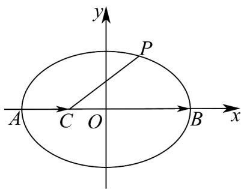

> [!faq]- 《高二数学上学期期中模拟卷（人教A版选择性必修第一册全部空间向量与立体几何+直线和圆+圆锥曲线，高效培优·提升卷）》官方解析
>
> > [!success]- **【答案】** 7或 $\frac{1}{7}$
>
> > [!note]- **【解析】**
> > 由曲线 $\Gamma : \frac{x^2}{16} + \frac{y^2}{12} = 1$ ，得 $a = 4, b = 2\sqrt{3}, c = 2$ ，则 $A(-4,0), B(4,0)$ ，
> >
> > 设 $P(x_0, y_0)$ ，则 $\frac{x_0^2}{16} + \frac{y_0^2}{12} = 1$ ，得 $y_0^2 = 12\left(1 - \frac{x_0^2}{16}\right)(-4 \leq x_0 \leq 4)$ ，
> >
> > 设 $C(m,0)(-4 < m < 4)$ ，则 $\left|PC\right| = \sqrt{\left(x_0 - m\right)^2 + y_0^2} = \sqrt{x_0^2 - 2mx_0 + m^2 + 12\left(1 - \frac{x_0^2}{16}\right)}$
> >
> > $$
> > = \sqrt {\frac {1}{4} \left(x _ {0} - 4 m\right) ^ {2} + 1 2 - 3 m ^ {2}}
> > $$
> >
> > 若 $m$ 0，则 $\left|PC\right|_{\max} = \sqrt{\frac{1}{4}\left(-4 - 4m\right)^2 + 12 - 3m^2} = 7$ ，得 $4(1 + m)^2 + 12 - 3m^2 = 49$
> >
> > 即 $m^{2} + 8m - 33 = 0$ ，解得 m = 3 或 m = -11（舍去）.
> >
> > 此时 $AC = (7,0)$ , $CB = (1,0)$ ，则 $AC = 7CB$ ，由 $AC = \lambda CB$ ，得 $\lambda = 7$ ；
> >
> > 若 $m < 0$ ， $\left|PC\right|_{\max} = \sqrt{\frac{1}{4}\left(4 - 4m\right)^2 + 12 - 3m^2} = 7$ ，得 $4(1 - m)^2 + 12 - 3m^2 = 49$
> >
> > 即 $m^2 - 8m - 33 = 0$ ，解得 $m = -3$ 或 $m = 11$ （舍去）.
> >
> > 此时 $AC = (1,0)$ , $CB = (7,0)$ ，则 $AC = \frac{1}{7}CB$ ，由 $AC = \lambda CB$ ，得 $\lambda = \frac{1}{7}$
> >
> > 故 $\lambda$ 的值为 $7$ 或 $\frac{1}{7}$
> >
> > 故答案为：7 或 $\frac{1}{7}$
> >
> > 
