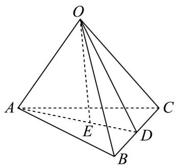

<!-- question-source:start -->
16. (15分)

如图，在三棱锥 $O - ABC$ 中，点 $D$ 为 $BC$ 的中点， $AE = \frac{2}{3} AD$ ，设 $OA = a, OB = b, OC = c$

(1)试用向量 a, b, c 表示向量 $OE$ ;

(2)若 $OA = OB = OC$ ，且 $\angle AOB = \angle BOC = \angle AOC = 90^{\circ}$ ，求证： $OE\perp$ 平面 $ABC$
<!-- question-source:end -->

![[高中/课堂同步/题库/人教A版高中数学同步讲义(2026)/03_选择性必修第一册/期中专项训练+期中模拟卷/高二数学上学期期中模拟卷（人教A版选择性必修第一册全部空间向量与立体几何+直线和圆+圆锥曲线，高效培优·提升卷）/四_解答题/questions/answers/Q00079666A1.md]]
