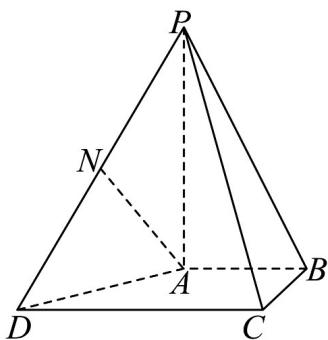

<!-- question-source:start -->
19. (17 分)

如图，在四棱锥 $P - ABCD$ 中， $PA \perp$ 平面 $ABCD$ ， $AB // CD$ ，且 $CD = 2$ ， $AB = 1$ ， $BC = 1$ ， $PA = 2$ ，

$AB \perp BC$ ，N 为 PD 的中点.

(1)求证： $AN \parallel$ 平面PBC；

(2)求二面角 $C - PD - A$ 的余弦值；

$$
\frac {\sqrt {6}}{3}
$$

(3)点 $M$ 在线段 $AP$ 上，直线 $CM$ 与平面 $PAD$ 所成角的正弦值为3，求点 $M$ 到平面 $PCD$ 的距离.
<!-- question-source:end -->

![[高中/课堂同步/题库/人教A版高中数学同步讲义(2026)/03_选择性必修第一册/期中专项训练+期中模拟卷/高二数学上学期期中模拟卷（人教A版选择性必修第一册全部空间向量与立体几何+直线和圆+圆锥曲线，高效培优·提升卷）/四_解答题/questions/answers/Q00079669A1.md]]
