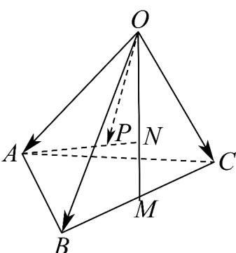

<!-- question-source:start -->
8. 如图，在四面体 $OABC$ 中， $M$ 为棱 $BC$ 的中点，点 $N, P$ 分别满足 $\overline{ON} = 2NM$ ， $\overline{AP} = \frac{2}{3}AN$ 则 $\overline{OP} =$ （）

A. $\frac{1}{3} OA + \frac{2}{3} OB + \frac{2}{3} OC$ B. $\frac{1}{3} OA + \frac{2}{9} OB + \frac{2}{9} OC$

C. $\frac{1}{3} OA + \frac{4}{9} OB + \frac{4}{9} OC$ D. $\frac{1}{3} OA + \frac{1}{3} OB + \frac{1}{3} OC$
<!-- question-source:end -->

![[高中/课堂同步/题库/人教A版高中数学同步讲义(2026)/03_选择性必修第一册/第一章 空间向量与立体几何/专项训练/专题01空间向量及其运算的四大常考题型_高效培优专项训练_/题型一_sec_02/questions/answers/Q00062648A1.md]]
