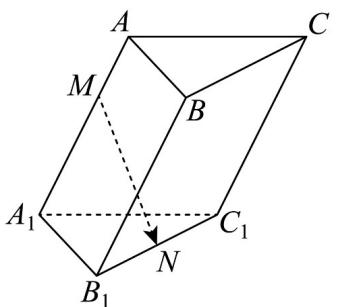

<!-- question-source:start -->
10. 已知三棱柱 $ABC - A_{1}B_{1}C_{1}$ 如图所示，其中 $\overline{A_1M} = 2\overline{MA}$ ，若点 $N$ 为棱 $B_{1}C_{1}$ 的中点，则 $\overline{MN} = (\quad)$

A. $\frac{1}{3} AA_{1} + \frac{2}{3} AB + \frac{1}{2} AC$ B. $\frac{2}{3} AA_{1} + \frac{1}{3} AB + \frac{1}{2} AC$ C. $\frac{1}{3} AA_{1} + \frac{1}{2} AB + \frac{1}{2} AC$ D. $\frac{2}{3} AA_{1} + \frac{1}{2} AB + \frac{1}{2} AC$
<!-- question-source:end -->

![[高中/课堂同步/题库/人教A版高中数学同步讲义(2026)/03_选择性必修第一册/第一章 空间向量与立体几何/专项训练/专题01空间向量及其运算的四大常考题型_高效培优专项训练_/题型一_sec_02/questions/answers/Q00062649A1.md]]
