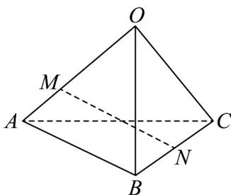

> [!faq]- 《专题01空间向量及其运算的四大常考题型_高效培优专项训练_》官方解析
>
> > [!success]- **【答案】** D
>
> > [!note]- **【分析】**
> > 利用空间向量的线性运算，分析即得解·
>
> > [!note]- **【解析】**
> > 
> >
> > 由题意， $MN = ON - OM = \frac{1}{2}(OB + OC) - \frac{2}{3}OA = -\frac{2}{3}a + \frac{1}{2}b + \frac{1}{2}c.$
> >
> > 故选 **D**.
