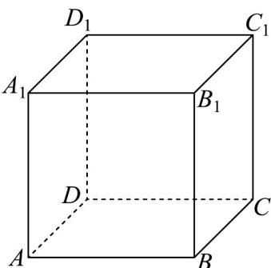

> [!faq]- 《专题01空间向量及其运算的四大常考题型_高效培优专项训练_》官方解析
>
> > [!success]- **【答案】** B
>
> > [!note]- **【分析】**
> > 根据方程组 $\left\{ \begin{array}{l} AA_{1} + AD = AD_{1} = c \\ AD + AB = AC = b \\ AA_{1} + AB = AB_{1} = a \end{array} \right.$ ，即可求解 $AB = \frac{1}{2}a + \frac{1}{2}c - \frac{1}{2}b$ 。【详解】由于 $\left\{ \begin{array}{l} AA_{1} + AD = AD_{1} = c \\ AD + AB = AC = b \\ AA_{1} + AB = AB_{1} = a \end{array} \right.$ ，所以 $AA_{1} = \frac{1}{2}a - \frac{1}{2}b + \frac{1}{2}c$ ， $AB = \frac{1}{2}a - \frac{1}{2}c + \frac{1}{2}b$ ， $AD = \frac{1}{2}b + \frac{1}{2}c - \frac{1}{2}a$ 。
>
> > [!note]- **【解析】**
> > 故选：B
> > 
